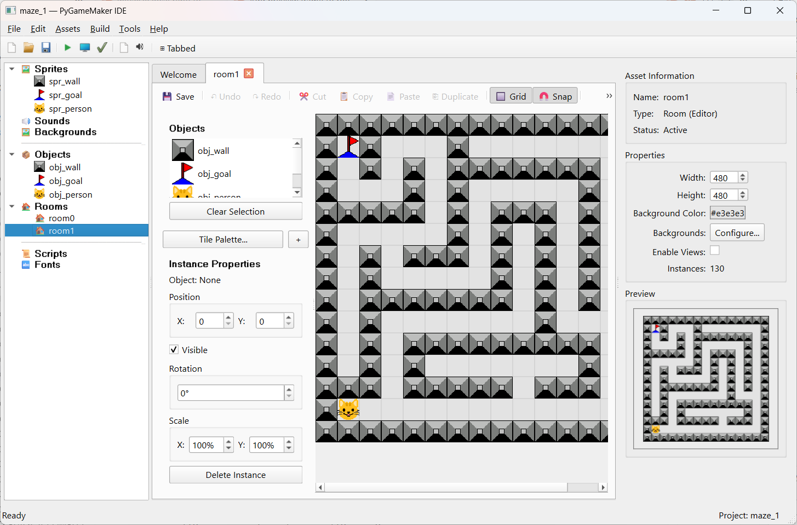

# PyGameMaker

A GameMaker-style visual game development IDE for creating 2D games with Python.


 


## ⬇️ Download PyGameMaker 1.0

**Version 1.0 is here** — grab a ready-to-run build. No Python install required:

| Platform | Download |
|----------|----------|
| **Windows** | [PyGameMaker.exe](https://github.com/Gabe1290/pythongm/releases/latest/download/PyGameMaker.exe) |
| **macOS** (Apple Silicon) | [PyGameMaker-macOS-ARM.zip](https://github.com/Gabe1290/pythongm/releases/latest/download/PyGameMaker-macOS-ARM.zip) |
| **macOS** (Intel) | [PyGameMaker-macOS-Intel.zip](https://github.com/Gabe1290/pythongm/releases/latest/download/PyGameMaker-macOS-Intel.zip) |
| **Linux** | [PyGameMaker-Linux.tar.gz](https://github.com/Gabe1290/pythongm/releases/latest/download/PyGameMaker-Linux.tar.gz) |

See **[all releases & release notes](https://github.com/Gabe1290/pythongm/releases)**, or read the **[Getting Started guide](https://github.com/Gabe1290/pythongm/wiki)** in the wiki. Prefer to run from source? See [Installation](#installation) below.

> **First launch:** on Windows, SmartScreen → *More info → Run anyway*; on macOS, right-click the app → *Open* to get past Gatekeeper.



*Building a maze in the PyGameMaker room editor, with a live preview of the room in the properties panel.*

## Educational Goals

This project serves a dual educational purpose:

1. **Learn Python through Game Development** - Use PyGameMaker to create games visually, then examine the generated Python/Pygame code to understand how game logic translates to real programming concepts.

2. **Learn Advanced Python through IDE Development** - Contribute to PyGameMaker itself and explore real-world software engineering: Qt GUI development, plugin architecture, code generation, internationalization, and more.

## Overview

PyGameMaker provides a familiar drag-and-drop interface inspired by classic GameMaker, allowing users to create games visually using:

- **Blockly Visual Programming** - Build game logic with visual code blocks
- **Traditional Event/Action System** - GM80-style event-driven programming
- **Asset Management** - Sprites, sounds, backgrounds, objects, and rooms
- **Multiple Export Targets** - HTML5, standalone executables, and more

## Features

- Visual sprite editor with animation strip support
- Room editor with instance placement
- Object editor with Blockly-based event programming
- Real-time game preview and testing
- Project import/export
- Multi-language support (English, French, German, Italian, Slovenian, Spanish, Ukrainian, Russian)

## Recent Improvements

### Internationalization
- Added complete Spanish (Español) translation with 650+ translated strings
- Added Russian language support with flag icons in the language menu
- Flag icons now displayed in the Tools → Language menu for easier selection

### UI/UX Enhancements
- Room preview now shows in properties panel when a room is selected in the asset tree
- Events tree expands by default to show actions immediately
- Right panel collapses automatically when object editor is active
- Fixed room editor properties not updating when switching between rooms
- Fixed inconsistent icon sizes in asset tree between sprites and objects

### New Features & Actions
- Added `show_message` action alias for Blockly compatibility
- Added `<self>` option to `set_sprite` action for current sprite animation
- Implemented 10 additional missing actions for game logic

### Bug Fixes
- Fixed infinite loop when navigating to next/previous room at boundaries
- Fixed broken dependency checks in EXE and Linux exporters
- Fixed asset_modified signal bug (now correctly uses asset_updated)

### Code Quality & Testing
- Added comprehensive test suite with 81+ ActionExecutor tests
- Added 19 event type tests for the event system
- Added runtime game engine unit tests and integration tests
- Configured flake8 for code quality with linting fixes applied
- Improved CI workflow with proper test structure

## Requirements

- Python 3.10 or higher
- PySide6 (Qt for Python)
- Pygame
- Pillow

## Installation

```bash
# Clone the repository
git clone https://github.com/Gabe1290/pythongm.git
cd pythongm

# Create virtual environment
python -m venv venv
source venv/bin/activate  # On Windows: venv\Scripts\activate

# Install dependencies
pip install PySide6 pygame Pillow
```

## Running

```bash
python main.py
```

## Project Structure

```
pygm2/
├── core/           # Core application logic
├── editors/        # Asset editors (sprite, object, room)
├── dialogs/        # UI dialogs
├── widgets/        # Custom Qt widgets
├── export/         # Game exporters (HTML5, EXE, Kivy)
├── config/         # Configuration and Blockly settings
├── translations/   # Language files
├── tutorials/      # Built-in tutorials
├── scripts/        # Build and utility scripts
└── docs/           # Documentation
```

## Building Standalone Executable

```bash
python scripts/build_nuitka.py
```

## License

The PyGameMaker **source code** is licensed under the **MIT License** — see [LICENSE](LICENSE).

The **documentation** (everything under `docs/`, `wiki/`, in-app tutorials, this README, the CHANGELOG, manuals and flyers) is licensed under **Creative Commons Attribution 4.0 International (CC BY 4.0)** — see [LICENSE-docs](LICENSE-docs).

Attribution: *Gabriel Thullen, 2025-2026*.

## Third-Party Libraries

- [PySide6](https://www.qt.io/qt-for-python) - Qt for Python (LGPLv3)
- [Pygame](https://www.pygame.org/) - Game development library (LGPLv2.1)
- [Pillow](https://python-pillow.org/) - Image processing (HPND License)
- [Blockly](https://developers.google.com/blockly) - Visual programming (Apache 2.0)

## Author

Gabriel Thullen

## Contributing

Contributions are welcome! Please feel free to submit issues and pull requests.
