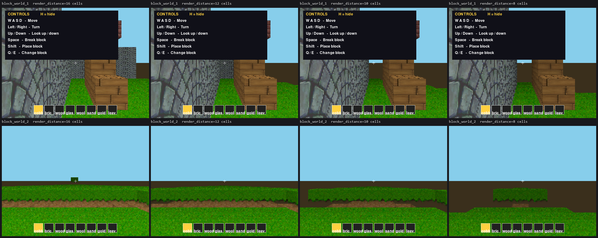

# Block World performance — the part A3 could not finish

Written 2026-09-06, after `docs/NOW_PLAN_2026-09-06.md`'s A3 closed. A3 took
`block_world_1` from 17.3 to 35.9 fps standing still (past its 30 fps target)
and from 3.5 to 16.5 walking, and doubled `block_world_2` — but
`block_world_2` still sits at **15.7 fps against a 30 fps target**, and every
lead in the A3.2 profile is now either shipped or measured and rejected.

The closing note said the rest "needs a different rendering approach". **That
turns out to be wrong, and this plan exists mostly to say so.** Measuring
before planning changed the shape of the work completely.

---

## The measurement that reframes everything

Stub out every draw call and let the sample run — marching, the column loop,
occlusion, all of it, drawing nothing:

| `block_world_2`, static | fps | ms/frame |
|---|---|---|
| as shipped | 15.4 | 64.9 |
| **with every draw call stubbed** | **74.0** | **13.5** |

So **drawing is 51.4 ms of a 64.9 ms frame; marching and the loop are 13.5 ms.**
The cost is the ~9,000 wall strips and ~2,550 horizontal faces the frame draws,
not the Python around them. (My own guess before measuring was the opposite.)

And the draw count is dominated by *distance*. Cells further than 8 cells away
account for roughly 70% of the frame:

| `block_world_2`, static | fps | vs shipped |
|---|---|---|
| `render_distance` 16 (shipped) | 15.4 | — |
| `render_distance` 14 | 18.7 | +21% |
| `render_distance` 12 | 23.7 | +54% |
| **`render_distance` 10** | **32.8** | **+113%, target met** |
| `render_distance` 8 | 50.5 | +228% |

A distant cell is cheap to *find* and expensive to *draw*: it contributes a
thin sliver a few pixels tall, and pays a full `_draw_wall_strip` — subsurface,
scale, shade, blit — for it. Nine thousand of those is the whole problem.

**So this is not a renderer rewrite. It is a draw-count problem, and the
biggest dial is already a parameter.**

---

## Why we cannot just lower `render_distance` today

Because it looks terrible, and for a fixable reason: **what shows through
beyond the render distance is the flat `floor_color` fill — a dark brown void —
not haze.**

Top row is `block_world_1`, bottom is `block_world_2`, at 16 / 12 / 10 / 8
cells. The maze barely changes. The open terrain is cut at 12 already, and by 8
most of the ground is a brown plane with a floating island of grass on it.

Two things are missing:

1. `wall_shade`/`face_shade` fade geometry toward **darkness** (`MIN_SHADE`
   0.35), not toward the horizon. Distant blocks go dim grey-green and then
   stop abruptly.
2. The floor and ceiling are two flat `fill`s meeting at the horizon
   (`renderer.py`, the two `screen.fill` calls before the column loop), so the
   place where the world runs out is exactly where a hard colour edge already
   is.

Every voxel game solves this the same way: fade the far distance into the sky,
and the cut becomes weather instead of a hole. Doing that here is a *visual
improvement in its own right* — the current hard edge is the least attractive
thing about `block_world_2` — that happens to unlock a 2–3× speed-up.

**Note the two samples want different answers.** `block_world_1` is an enclosed
maze: rendered at 16 / 12 / 10 / 8 cells the four pictures are essentially
identical, because walls block sight long before 8 cells. It can drop to 8 for
free, today, with no fog work at all. Open terrain is the case that needs the
fog.

---

## Phase 1 — fog to the horizon, then a shorter default distance

The whole win, and it is a *rendering* change, not a rewrite.

- [ ] **1.1 Fade to horizon, not to black.** Give the camera config a
      `fog_color` (defaulting to the existing `ceiling_color`, so an unchanged
      project looks the same as long as `render_distance` is unchanged) and
      blend each strip's colour toward it by the same `t` the shade curve
      already computes. `wall_shade`/`face_shade` currently return a scalar
      multiplier; they need to return, or be paired with, a blend factor.
      **Watch the cost:** a per-strip `Surface.fill(BLEND_RGB_MULT)` is already
      7.2% of the frame; a second per-strip blend must not simply double it —
      fold it into the same fill where possible (pre-multiply the source
      column, as `_draw_wall_strip` already does above its threshold).
- [ ] **1.2 Haze band at the horizon.** The floor and ceiling fills become a
      small vertical gradient toward `fog_color` near the horizon line instead
      of two flat rectangles. A handful of `fill`s per frame, not per column —
      negligible cost.
- [ ] **1.3 Lower the default `render_distance`** once 1.1–1.2 make it
      invisible. **10 cells is the number to aim for: it measures 32.8 fps,
      i.e. the target met, with no other change at all.** 8 would give 50 fps
      if the fog turns out to hide it. Pick it against screenshots, not
      against the fps figure alone.
- [ ] **1.4 Three targets, one number — again.** `render_distance` is
      duplicated in `export_html5.js` and `export_kivy.py` exactly as `columns`
      was, and 2a5e52bc had to fix six copies. Extend
      `tests/test_block_world_default_columns.py` (or a sibling) to pin the
      distance and any new fog default across all three renderers *in the same
      commit* as the change.

**Expected: `block_world_2` from 15.7 to ~33 fps at 10 cells, or ~50 at 8** —
so this phase alone meets the 30 fps target, and Phases 2 and 3 exist only in
case the fog cannot hide a distance that short.

---

## Phase 2 — make each strip cheaper (only if Phase 1 falls short)

Measured with a spike against `block_world_2`'s real shape (9,000 strips, 4px
wide, mostly short):

| approach | ms/frame | vs today |
|---|---|---|
| `scale` + `blit`, one call each (today) | 10.4 | 1.00× |
| `Surface.blits()` batched | 11.3 | **0.92× — slower** |
| `scale` into a **reused destination surface** | 7.5 | 1.38× |
| reused destination + `blits()` | 6.4 | 1.63× |
| `fill` only, no scaling (floor for any strip approach) | 2.9 | 3.55× |

- [ ] **2.1 Scale into a cached destination surface per strip height.**
      `pygame.transform.scale` accepts a destination surface, which skips the
      per-strip allocation. Confirmed available in pygame 2.6.1. **1.38× on the
      surface ops**, and the ops are ~10 ms of a 65 ms frame — so perhaps +5%
      overall. Modest, and worth doing only if the target is still out of reach.
- [ ] **2.2 The Python bodies, not the pygame calls, are the larger half.**
      Drawing costs 51 ms; the pygame ops in it are ~10 ms. The other ~41 ms is
      the Python inside `_draw_wall_strip` and `_draw_horizontal_face_textured`
      (whose `_texel` closure runs per sampled row). Cutting that means calling
      them less often, which is Phase 1, or making them do less per call — the
      A3.3 passes already took the easy 15%.

---

## Phase 3 — a genuinely different compositing approach

Only if Phases 1–2 both land and it is still short, and with a decision taken
first, because **this is the expensive one**.

- **DECIDED 2026-09-06: numpy is not going in.** The user's call, asked and
  answered — so the "numpy-vectorised column compositing" idea carried in
  `TODO.md` since August is now closed, not deferred. Do not re-propose it.
  The reasoning, for anyone who meets the idea again: numpy is not installed
  here and appears nowhere in the project — not in `requirements*.txt`, not in
  `pyproject.toml`, not imported by a single file — so adopting it means a hard
  dependency for the IDE **and for every exported desktop game** (~15–20 MB in
  each PyInstaller bundle, plus one more `pip install` for a teacher without
  admin rights), against the export-dependency decision recorded in
  `CLAUDE.md`. It would also help the desktop renderer only: HTML5 runs under
  Pyodide and Kivy generates its own code, so the three targets would drift
  apart unless each got its own equivalent. And the win is not automatic —
  the DDA march is sequential per column and does not vectorise, so only part
  of the frame's work would move into C. `pygame.surfarray` requires numpy, so
  it falls under the same decision.
- The no-new-dependency version is to composite a frame into a `bytearray` and
  push it with `Surface.get_buffer()` / `frombuffer`. The ceiling is real —
  **one 640×480 blit is 0.2 ms against today's 10.4 ms of strip ops** — but
  every per-pixel loop that fills that buffer is pure Python, which is how we
  got here.
- The honest read: Phase 3 is a rewrite of `render_block_world_view`,
  `_draw_wall_strip` and `_draw_horizontal_face_textured` **on three separate
  hand-written renderers** (desktop, `export_html5.js`, `export_kivy.py`) to
  keep parity. That is a multi-session project for a sample that was
  deliberately de-showcased in August. Phase 1 should make it unnecessary.

---

## Measured and rejected — do not re-propose these

- **Merging adjacent columns that share a face.** The mean run of identical
  adjacent columns is **1.05** (`block_world_2`) to **1.12** (`block_world_1`):
  each column has its own distance, hence its own strip height and shade, so
  almost nothing is mergeable. Loosening to "within 1px" changes nothing.
  Rejected 2026-09-06 with the measurement, and already recorded in `TODO.md`.
- **`Surface.blits()` on its own.** Measured **slower** than individual blits
  for this workload — building the sequence costs more than the saved call
  overhead. It only pays combined with 2.1.
- **More occlusion culling.** The August pass already showed it is a net loss
  on open terrain: long sightlines over rolling ground rarely occlude, so
  every column pays the bookkeeping. Same reason merging fails.

---

## Is this worth doing at all?

Stated plainly so the decision is deliberate:

- `block_world_1` **already meets its target** standing still and is playable
  walking. Only `block_world_2` (open procedural terrain) is short.
- Both samples were **removed from the Welcome tab in August** in favour of
  `sky_strike_1`, so no student meets them unless they go looking.
- Phase 1 is, however, cheap and improves how the sample *looks* regardless of
  frame rate — the hard brown cut at the render distance is a visible flaw
  today, at any speed.

**Recommendation: do Phase 1, stop, and re-measure.** It is a day's work at
most, it fixes a real visual defect, and it is the only phase with a plausible
path to the 30 fps target. Phases 2 and 3 should not start without new numbers
saying they are needed.

---

## How to measure anything here

`tools/measure_block_world_fps.py` — real `GameRunner`, headless, warmup
discarded, conditions interleaved, `--profile` for a cProfile breakdown,
`PYGM_ROOT` to point it at a worktree.

**Two disciplines this work established the hard way, both non-negotiable:**

1. **A/B against a `git worktree` in the same sitting.** This desktop's speed
   drifts ~10% over half an hour; a "before" number from earlier in the session
   once made a 3.4× win look like a regression everywhere.
2. **Prove pixel-identity on the real render path** for anything claimed to be
   behaviour-preserving: hash the finished frame at `pygame.display.flip()`
   over a matrix of scripted camera paths (spawn, walk, strafe, turn, pitch
   up/down and combinations), and confirm the capture is deterministic by
   running the baseline twice before trusting it as a comparison.

### Appendix — the spikes behind the numbers

All throwaway, in this session's scratchpad; re-create as needed:

- **draw-free floor**: monkeypatch `_draw_wall_strip`,
  `_draw_horizontal_face_textured` and `_draw_horizontal_face` to no-ops on the
  *loaded* extension module (the loader imports it under a synthetic package
  name — resolve it by scanning `sys.modules` for a name ending
  `block_world.renderer`), then time the loop.
- **merge potential**: spy on `_draw_wall_strip`, group by `x0`, compare each
  column's strip list with its neighbour's.
- **batching spike**: 9,000 synthetic strips, timing the five approaches in the
  Phase 2 table.
- **screenshots**: override `render_distance` / `columns` on the live camera
  config (`state.peek_camera(room)`) at frame 2 and capture at
  `display.flip()` — no need to edit the samples.
