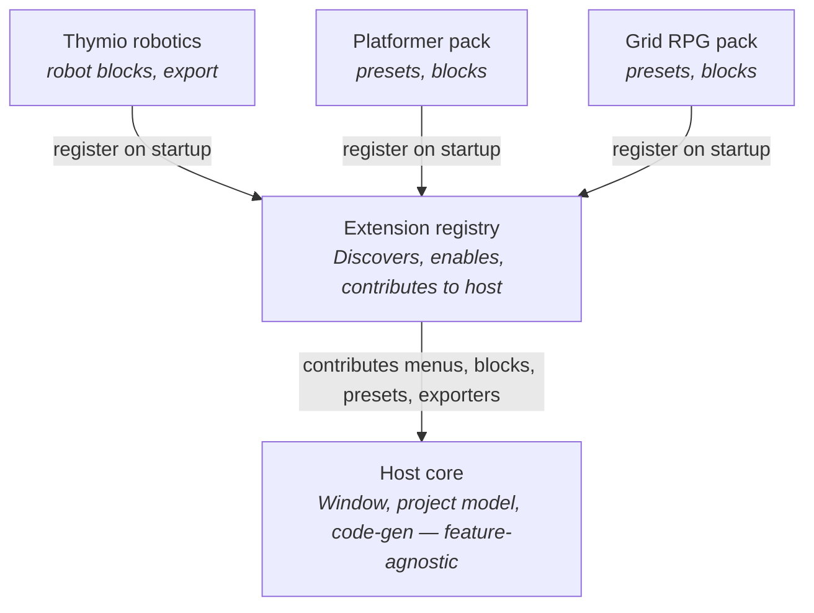

# Design Doc: Extension System for PyGameMaker

| | |
|---|---|
| **Status** | Draft / proposed |
| **Target** | Post-1.0 |
| **Scope** | First-party, bundled extensions only (no third-party marketplace in 1.x) |
| **Author** | Gabe |

---

## 1. Context

PyGameMaker has grown into a multi-feature educational IDE (PyQt6 core, Blockly
visual scripting, GM-style event editor, Kivy export pipeline, and feature-specific
work such as Thymio robotics support). As the feature count rises, a single
conceptual feature tends to spread across several core files, which makes the
project harder to maintain and harder to extend.

A concrete example: adding Thymio support today plausibly touches the menu setup,
the Blockly block/category definitions, the preset list, and the code generator.
Adding *or removing* such a feature therefore means editing the core in multiple
places.

The goal of this document is to evaluate and specify an **extension system** that
lets features be packaged as self-contained, toggleable units.

### What we already have (the foundation)

We are not starting from zero. The existing **Blockly config system** is effectively
a single-domain plugin-toggle system already:

- enabled blocks / enabled categories (sets)
- five presets (Full, Beginner, Intermediate, Platformer, Grid RPG)
- `BLOCK_DEPENDENCIES` dependency tracking with warnings
- a configuration dialog (tree view, per-block and per-category checkboxes)
- persistence to `~/.config/pygamemaker/blockly_config.json`

The extension system is a **generalization of these patterns**, not a new invention.

---

## 2. Goals

- Make features modular: a feature lives in one place and can be added or removed
  as a unit.
- Extensions contribute to the IDE through a fixed contract instead of the core
  importing each feature by name.
- Extensions can be enabled/disabled; their menu entries (and other contributions)
  appear only when enabled.
- Some presets become extension-owned, so installing a feature pack brings its
  preset along.
- Improve maintainability and lower the cost of adding future features.

## 3. Non-goals (for 1.x)

- **No third-party / downloadable extensions.** For a tool used by children on
  mixed hardware, running arbitrary downloaded Python is a real safety concern.
  1.x ships *first-party, bundled* extensions only — they are ours, shipped with
  the app, just modular internally. A marketplace is a separate, much later
  decision.
- No change to the user-facing game-authoring experience beyond the new manager UI.
- No rewrite. This is an incremental refactor; each step ships independently.

---

## 4. Core concepts

Three terms define the design:

- **Host** — the stable core (main window, project model, asset manager, code-gen
  engine). It exposes a fixed set of hook points and otherwise knows nothing about
  specific features.
- **Extension contract** — the agreed interface every extension implements (a
  Python abstract base class). The host calls these methods at known moments.
- **Registry** (extension manager) — discovers extensions, tracks which are enabled,
  persists that state, and asks each enabled extension to *contribute* its menus,
  blocks, presets, and exporters.

The key inversion: instead of the core *knowing about* Thymio, Thymio *registers
itself with* the core.

---

## 5. Proposed architecture



The host sits at the top and is deliberately ignorant of any specific feature. Each
extension registers itself with the registry, which is the only component that knows
what is installed and enabled. The registry contributes each enabled extension's
pieces upward into the core. The menu bar is **rebuilt** from those contributions —
which is exactly what makes entries appear and disappear.

### 5.1 The extension contract

A small base class every extension implements (illustrative sketch):

```python
class Extension:
    id = "thymio"
    name = "Thymio Robotics"
    version = "1.0"
    requires = []          # ids of other extensions this one depends on

    def menu_items(self): ...        # menu entries to inject
    def blocks(self): ...            # block + category definitions
    def presets(self): ...           # presets this extension owns
    def code_generators(self): ...   # export hooks (e.g. Thymio/Aseba output)
    def on_enable(self, host): ...
    def on_disable(self, host): ...
```

### 5.2 The registry

The registry holds a list of discovered extensions and a set of enabled ids,
persisted exactly like the existing `blockly_config.json` persists enabled blocks.

**Discovery (1.x):** scan a bundled `extensions/` folder at startup. No packaging
ceremony — a folder is an extension. This keeps it simple to add or remove a feature
during development.

When the app builds its UI, instead of `setup_menu()` hardcoding `QAction`s, it asks
the registry for every menu item from every enabled extension and adds those.

### 5.3 Suggested layout

```
pygamemaker/
  core/                  # host: main window, project model, code-gen engine
  extensions/
    thymio/
      __init__.py        # defines the Thymio Extension subclass
      blocks.py
      codegen.py
      presets.py
    platformer/
    grid_rpg/
  registry.py            # discovery, enable/disable, persistence, validation
```

---

## 6. Feature-by-feature feasibility

### 6.1 Menus appearing / disappearing — **low risk**

Same pattern as the existing block toggles, applied to `QAction`s. The host keeps a
`rebuild_menus()` method that clears the dynamic portions and re-adds items from
currently-enabled extensions. Toggling an extension in the manager dialog calls
`on_disable` / `on_enable` then `rebuild_menus()`. PyQt6 handles dynamic menu
modification cleanly — no technical obstacle.

### 6.2 The Thymio extraction (the worked example) — **medium**

Thymio is the ideal first extension because it is a vertical slice that currently
cuts across the core. A robotics feature typically owns: Blockly blocks (motors,
LEDs, proximity sensors), a code generator emitting robot-runnable output, menu
entries, and likely a robot-specific preset. Each maps onto a contract method.

> **Caveat / unknown:** the real work is wherever the current Thymio code reaches
> *into* core classes (e.g. the main window calls a Thymio method directly, or the
> code generator has `if thymio:` branches). The fix is to invert these so the host
> calls *out* through the contract. Mechanical, but this is where the hours go.
> A precise extraction plan needs a read of the current Thymio files.

### 6.3 Moving presets into extensions — **feasible, with one nuance**

Presets split into two kinds:

- **Core presets** (skill levels): Beginner, Intermediate, Full — describe skill,
  not features. Stay in the core.
- **Extension-owned presets** (feature-shaped): Platformer, Grid RPG — installing
  the pack is what makes its preset appear.

**Nuance:** the existing `BLOCK_DEPENDENCIES` concern extends here. A preset enables
specific blocks; if those blocks live in a disabled extension, the preset references
something that does not exist. Rule: **a preset is only offered if the extensions it
depends on are enabled.** This generalizes the existing block→block dependency
tracking to preset→extension.

---

## 7. Risks and hard parts

### 7.1 Project-file compatibility when an extension is missing — **highest priority**

The scenario: a student builds a game using Thymio blocks, then opens it on a school
machine where the Thymio extension is not installed.

Given the target audience (children on mixed hardware), this is core to the feature
being usable, not a nicety. **Design this first.**

Proposed approach:

- The project save file records which extension ids (and versions) it depends on.
- On load, the registry checks those dependencies and either:
  - warns and gracefully disables the missing parts, or
  - refuses to open with a clear, child-readable message naming the missing
    extension.
- Define the exact behavior before any extraction work so the save format is stable.

### 7.2 Code-generator coupling — **medium**

If export logic currently has feature-specific branches, extensions need a clean
hook to *register* generators rather than the generator knowing about each feature.
Until untangled, "remove the Thymio extension" will not fully remove Thymio's reach.

### 7.3 Versioning and trust — **scoped out of 1.x**

A real plugin system invites third-party extensions. For a children's tool, running
arbitrary downloaded Python is a meaningful safety risk. 1.x = first-party, bundled
extensions only. Marketplace = later, separate decision (see Non-goals).

---

## 8. Migration plan (incremental, each step revertible)

This front-loads the boring structural work and defers anything irreversible. Each
step ships independently.

1. **Introduce the registry and contract** alongside the existing code, removing
   nothing. The core still works exactly as today; the registry just exists.
2. **Migrate the menu build** to pull from the registry. Purely internal, no
   behavior change.
3. **Extract one real extension end-to-end (Thymio).** It exercises every
   contribution type, so this is where the true coupling is discovered.
4. **Add the manager dialog and persistence**, reusing the existing Blockly
   config-dialog code.
5. **Define and implement the missing-extension / project-dependency behavior**
   (section 7.1).
6. **Move feature-shaped presets** (Platformer, Grid RPG) into their extensions.

---

## 9. Verdict

Clearly feasible, genuinely worth doing for maintainability, and well-matched to
patterns already in the codebase. The architecture is not the risk — the
project-file compatibility story (7.1) is, and it is solvable with upfront design.

---

## 10. Open questions

- Does the current Thymio code call into core classes, or is it already loosely
  coupled? (Determines the effort in step 3.)
- Does the Kivy code generator currently contain feature-specific branches?
- What is the exact current project save format, and where would the
  extension-dependency list live within it?
- Should disabling an extension that a project depends on be blocked while that
  project is open, or allowed with a warning?
- Minimum viable manager UI: reuse the Blockly config dialog wholesale, or a
  simpler enable/disable list to start?

---

## 11. Answers to open questions

*Answered against the repo as of 2026-06-13. Line numbers are from the files as
they stand today; treat them as anchors, not guarantees.*

### 11.1 Coupling — is Thymio loosely coupled, or does it call into core?

**Verdict: the coupling is overwhelmingly one-directional — core reaches *into*
Thymio, not the reverse.** The Thymio modules themselves are nearly self-contained;
the cost of step 3 is in *core*, not in the Thymio files.

**Thymio → core (almost nothing).** The only thing any Thymio module imports from
core is the logger:

- `runtime/thymio_action_handlers.py:12` — `from core.logger import get_logger`
- `widgets/thymio_playground.py:33` — `from core.logger import get_logger`
- `editors/object_editor/thymio_events_panel.py:25` — `from core.logger import get_logger`

No Thymio file imports the main window, `ProjectManager`, the code generator, or the
asset manager. `actions/thymio_actions.py`, `events/thymio_events.py`, the three
`dialogs/thymio_*.py`, and `widgets/thymio_diagram_widget.py` have **no** core
imports at all. `dialogs/thymio_config_dialog.py:12-19` imports from
`config/blockly_config.py` and `dialogs/_block_config_dialog_base.py` — a peer/UI
dependency, not a core-host one. So inverting these is trivial; there is almost
nothing to invert on the Thymio side.

**Core → Thymio (this is the real work).** The main window
[`core/ide_window.py`](core/ide_window.py) knows about Thymio by name in many places:

- `core/ide_window.py:24` — `from dialogs.thymio_config_dialog import ThymioConfigDialog` (the one hard top-level import).
- Menu/toolbar wiring: `:186` (Aseba export action), `:296-298` (Configure Thymio Blocks), `:316-341` (the whole "🤖 Thymio Programming" submenu — show-tab toggle, playground, add-event/add-action, import-Roberta), `:863-870` (toolbar quick-add).
- Handlers: `configure_thymio()` `:2691-2732`, `toggle_thymio_tab()` `:2760-2773`, `show_thymio_playground()` `:2775-2782`, `show_thymio_event_selector()` `:2784-2814`, `show_thymio_action_selector()` `:2816-2851`, plus Aseba export at `:2316`/`:2350-2351`.
- Enable/disable bookkeeping tied to project state: `:3877`, `:3909-3928`.

Beyond the main window, Thymio is **merged into core registries at import time**,
which is the more insidious coupling because it is not gated by any toggle:

- `events/event_types.py:12` imports `THYMIO_EVENT_TYPES` and `:250` splats it into the global `EVENT_TYPES`; `:296-297` registers each into `EVENT_TO_BLOCKLY_MAP`.
- `actions/__init__.py:23,28-29` re-exports `THYMIO_ACTIONS` / `THYMIO_TAB`; `actions/core.py:130-134` hardcodes a "thymio" entry in `ACTION_CATEGORIES`.
- `config/blockly_config.py:130-186` defines the Thymio block categories, `:629-646` `get_thymio()`, `:1093` the `"thymio"` preset.
- `runtime/game_runner.py:33-35` imports the simulator, renderer, and `register_thymio_actions` at module top level.

**`if thymio`-style branches (flag this — these are exactly what the contract must
absorb).** The most load-bearing is the runtime, which carries an `is_thymio` flag
and branches on it ~10 times:

- `runtime/game_runner.py:534` (`self.is_thymio = False`), `:1220-1228` (classify by name prefix `startswith('thymio')` **or** `instance_data.get('is_thymio')`), `:1474`, `:1483`, `:2443`, `:2558`, `:2621`, `:4351`, `:5071`, `:5082`.
- The same `name.startswith('thymio') or ...get('is_thymio')` test is duplicated in `export/Aseba/aseba_exporter.py:104`, `export/Roberta/roberta_exporter.py:108`, `editors/playground_editor/__init__.py:292-294`, and is *written* by `importers/roberta_importer.py:201`.
- UI gates: `core/ide_window.py:2770` (`hasattr(widget, 'set_thymio_tab_visible')`), `editors/object_editor/object_editor_main.py:270` (`if Config.get('show_thymio_tab', False)`), `editors/object_editor/object_events_panel.py:219` (`if is_thymio_event(...)`), `widgets/__init__.py:30-32` (lazy import branch on the class name).

**Implication for step 3.** The extraction is mechanical but spread out. The Thymio
files barely need touching; the work is (a) moving the main-window menu/handler block
behind `menu_items()` / `on_enable()`, (b) replacing the import-time splats in
`event_types.py` / `actions` / `blockly_config.py` with registry contributions, and
(c) deciding what to do with the runtime `is_thymio` branches — note these live in the
*runtime engine* (`game_runner.py`), which the design doc's "host" diagram doesn't
explicitly cover. The string-prefix convention (`name.startswith('thymio')`) is a
de-facto coupling that should become an explicit `is_thymio` data flag everywhere.

### 11.2 Code generator — feature-specific branches in the Kivy pipeline?

**Verdict: no. The Kivy pipeline is already feature-agnostic; Thymio export lives in
entirely separate exporters.** This question is already in the desired end-state.

- A grep for `thymio|aseba|roberta|robot` across `export/Kivy/code_generator.py` (711 lines) and `export/Kivy/kivy_exporter.py` (2796 lines) returns **zero** matches. Verified directly.
- Thymio gets its own dedicated, self-contained exporters that the Kivy path never calls: `export/Aseba/aseba_exporter.py` (`AsebaExporter`, AESL output, finds Thymio objects at `:58`/`:104`) and `export/Roberta/roberta_exporter.py` (`RobertaExporter`, Open Roberta XML, `:69`/`:108`).

**The one caveat — it's not a *registry*, it's a hardcoded `if/elif` chain.** The Kivy
generator dispatches actions with two long `if/elif` ladders keyed on `action_type`,
not a handler table: `ActionCodeGenerator.process_action()`
([`export/Kivy/code_generator.py`](export/Kivy/code_generator.py)) at `:64-410`,
falling through to `_convert_simple_action()` at `:411-709` (unknown types hit a
`logger.warning` fallback at `:707-709`). So while there are no *feature* branches
today, an extension that wanted to contribute Kivy codegen would currently have to
edit that chain. The design's `code_generators()` hook (§5.1) should target this:
the chain wants to become a dict dispatch that extensions can register into. Note the
existing Thymio exporters are themselves *not* plugged into any registry — they're
invoked directly from the main window (`export_aseba_code`), so "register a generator"
(§7.2) is new work even though there are no branches to untangle.

### 11.3 Project save format — and where does the extension-dependency list live?

**Format.** A saved project is **a folder, not a single file** (no `.gmp` blob).
[`core/project_manager.py`](core/project_manager.py): `save_project()` `:405-429` →
`_save_to_folder()` `:431-503`, with `_prepare_project_data_for_save()` `:642-669`.
The folder root holds `project.json` plus subfolders (`sprites/`, `objects/`,
`rooms/`, `playgrounds/`, `thumbnails/`); large per-asset data (room instances,
playground walls/robots) is split into external files referenced by an
`_external_file` pointer (`:649-667`).

`project.json` top-level keys: `name`, `version`, `created`, `modified`, `settings`,
`assets`. Confirmed against `samples/maze_1/project.json`:

```json
{
  "name": "maze_1",
  "version": "1.0.0",
  "created": "...", "modified": "...",
  "settings": {
    "window_title": "", "window_width": 480, "window_height": 480,
    "room_speed": 30, "fullscreen": false,
    "starting_lives": 3, "starting_score": 0, "starting_health": 100,
    "blockly_preset": "full"
  },
  "assets": { "sprites": {...}, "sounds": {}, "backgrounds": {},
              "objects": {...}, "rooms": {...} }
}
```

- The version field is `version` (string), `PROJECT_VERSION = "1.0.0"` at `core/project_manager.py:80`, written at creation (`:1167`). It's a *project* version, not a schema/format version — no separate schema-version field exists. (The legacy `test_thymio_project.json` carries `"0.11.0"`, so the field does change over time.)
- **The loader is permissive**, which matters for forward-compat: `_validate_project_data()` `:1254-1266` requires only `["name", "version", "assets"]` and that `assets` is a dict. Unknown top-level keys are **silently preserved/ignored**, and the file is loaded as an `OrderedDict` (`:228`). So adding a new top-level key will not break older builds' loaders — they'll skip it.
- No `extensions` / `plugins` / `requires` / `dependencies` field exists today (grep of the project manager and a sample returns nothing).

**Where the dependency list should live.** Two viable homes; I recommend **a new
top-level `extensions` key**, not a nested one:

- `settings.blockly_preset` (`:1170-1177`, set from the dialog at `core/ide_window.py:2674`) already proves the pattern of recording "which feature-config this project expects." A parallel `settings.extensions` would be consistent — *but* `settings` is semantically per-game runtime config (window size, lives), and an extension-dependency manifest is metadata *about* the file.
- Prefer a **top-level `extensions`** list/map (siblings of `version`/`assets`),
  e.g. `"extensions": {"thymio": "1.0"}` — id→version, mirroring the contract's
  `id`/`version`/`requires` (§5.1). It survives the permissive loader on old builds,
  it's where the registry naturally writes/reads at save/load, and it keeps
  file-level metadata out of the game's runtime `settings`. Populate it at save time
  from the registry (analogous to how `blockly_preset` is stamped into `settings`),
  and read it in `load_project()` right after `_validate_project_data()` so the
  missing-extension check (§7.1) runs before editors open.

### 11.4 Disabling an extension a project depends on — block, or warn-and-allow?

**Recommendation: warn-and-allow, gracefully — do *not* hard-block.** Two facts about
how loading works today drive this:

1. **The app is single-document** (`core/ide_window.py:84-85`: a single `current_project_path` / `current_project_data`; opening a project tears down all editors at `on_project_loaded()` `:3787-3837`, `:3791-3799`). So "while a project is open" is an unambiguous, single state — a block *would* be enforceable. But —
2. **Config changes already propagate live and non-destructively.** The Blockly config dialog flow (`configure_blockly()` `:2642-2689`) saves config, optionally stamps the project preset, then calls `refresh_event_panels_config()` `:2734-2758`, which pushes the new config into every open editor via `events_panel.apply_config()` and `blockly_widget.apply_configuration()`. Disabling blocks **filters the palette; it does not mutate the saved project data** (object events/actions, room instances are untouched). The same path is already used for Thymio (`configure_thymio()` `:2722`).

Because disabling is already a reversible, UI-layer filter — not a data migration —
blocking it would be inconsistent with the one toggle system that exists. The right
behavior is the design doc's first bullet in §7.1: **warn and gracefully disable the
missing parts.** Concretely: on disable-while-depended-upon, show a child-readable
warning ("This game uses Thymio blocks — turning Thymio off will hide them; your game
is not changed and they come back when you turn it on"), then disable and
`rebuild_menus()` + `refresh_event_panels_config()`. Crucially, **never silently drop
the blocks from the project on save** — preserve the unknown blocks as opaque data
(the loader is already permissive, §11.3) so re-enabling restores them. Reserve a hard
block only for the *load* path on a machine where the extension is genuinely absent
(§7.1's second bullet), where graceful degradation may be impossible.

### 11.5 Manager UI — reuse the Blockly config dialog, or start simpler?

**Recommendation: reuse the existing base dialog — but the right thing to reuse is
`BaseBlockConfigDialog`, not `BlocklyConfigDialog`.** The reuse case is unusually
strong here because *the generalization already happened once.*

- `dialogs/blockly_config_dialog.py` is a thin (~146-line) subclass; ~98% of the logic lives in `dialogs/_block_config_dialog_base.py` (`BaseBlockConfigDialog`, ~406 lines): `setup_ui()` `:143-216` (preset combo, two-column tree, dependency warning label, Select-All/None, Save/Cancel) and `populate_tree()` `:218-290`.
- The base is **already parameterized via override hooks** — `_window_title()` `:82`, `_preset_items()` `:88`, `_tree_column0_width()` `:94`, `_include_category()` `:97`, `_category_color()` `:100`. The subclass supplies only domain specifics.
- Decisive evidence: **there are already two subclasses** — `BlocklyConfigDialog` *and* `ThymioConfigDialog` (`dialogs/thymio_config_dialog.py`, whose own docstring says the "preset combo / category tree / dependency-warning / save scaffold is shared … via BaseBlockConfigDialog"). The pattern has been proven across two domains; an extension manager would be the third subclass.

**But note the impedance mismatch.** That dialog models a *tree of blocks within
categories with block→block dependencies*. An extension manager is a *flat list of
extensions with extension→extension `requires`* (§5.1) — shallower, and the
dependency semantics differ. So the honest answer is in between the two options as
posed:

- **For step 4's MVP, start with a simple flat enable/disable list** (a `QListWidget`/checkbox list of discovered extensions with name + version + description). It's a day of work, matches the actual data shape, and avoids forcing extensions into a fake category tree.
- **Borrow the proven *machinery*, not the tree.** Reuse the surrounding scaffold the base already nails — the dependency-warning label, Select-All/None, native Save/Cancel ordering, and the persistence round-trip pattern that `config/blockly_config.py` `load_config()`/`save_config()` (`:1112-1160`, writing `~/.config/pygamemaker/blockly_config.json`) demonstrates for the enabled-set + preset model. The registry's enabled-id set persists "exactly like blockly_config.json" (§5.2), so that half is a direct lift.

In short: don't reuse `BlocklyConfigDialog` wholesale (its tree is overkill), but the
existence of `BaseBlockConfigDialog` + two subclasses means the dialog *patterns* are
battle-tested and the manager is a small, low-risk addition rather than a new UI.
