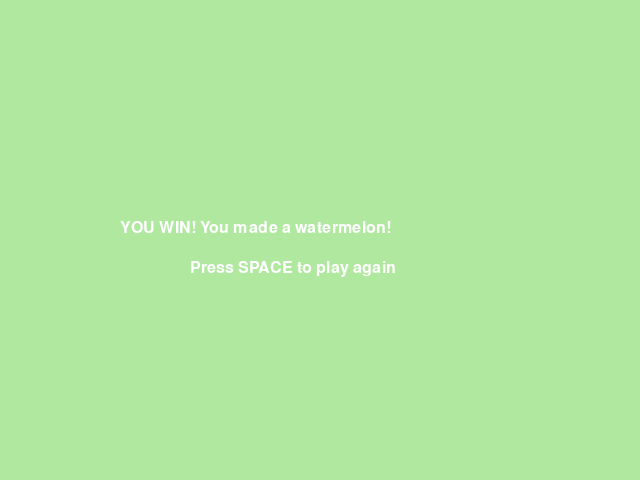
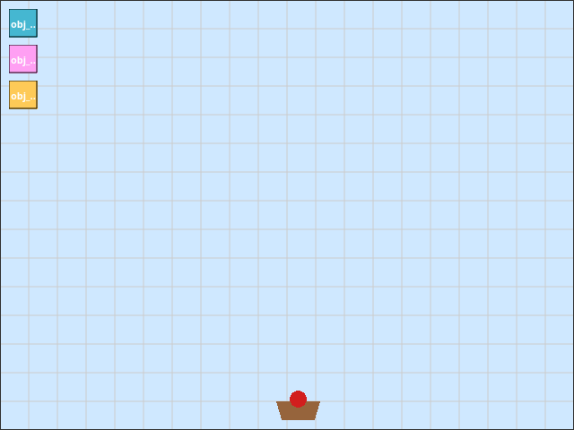

# PyGameMaker — Tutorial 15: Fruit Fusion

## How to Use This Handout

This handout goes with the in-app tutorial **Help > Tutorials > Fruit Fusion: Catch and Merge!** (5 pages, about 20-25 minutes). Keep the tutorial open on one half of your screen. Tick each box when the step is done, and check the **You should see** line at the end of every phase. If something does not match, look at **Stuck?** before you call your teacher.

## What You Will Make

A basket that always holds one fruit, starting with a cherry. Cherries, strawberries and oranges fall from the sky. Catch a fruit that matches what you are holding and it fuses into the next, bigger fruit. Fuse all the way up to a watermelon and you win!

## Phase 1: Moving Basket

- [ ] **1.** Make a new project `FruitFusion`.
- [ ] **2.** Create a sprite `spr_basket_empty` (56x40, a brown bowl shape) and an object `obj_player` with that sprite.
- [ ] **3.** Create a room `room_main` and place `obj_player` near the bottom center.
- [ ] **4.** In `obj_player`: **Keyboard: Left Arrow (held)** with *Set horizontal speed to -5*; **Right Arrow (held)** with *5*; **Keyboard: No key** with *Stop movement*.

> DONE: **You should see:** press **F5**. Left and Right move the basket, and it stops when you let go.

## Phase 2: First Fusion

- [ ] **5.** Create a sprite `spr_fruit_cherry` (20x20, a red circle) and an object `obj_fruit_cherry` with a **Create** event (*Set vertical speed 3*) and an **Outside Room** event (*Destroy this instance*).
- [ ] **6.** Create `obj_spawn_cherry` (no sprite) with a **Create** event (*Set alarm 0 to 90*) and an **Alarm 0** event (*Create instance of obj_fruit_cherry at a random x, y 0*, then *Set alarm 0 to 90* again). Place one in `room_main`.
- [ ] **7.** Change `obj_player`'s sprite to a new sprite `spr_basket_cherry` (a bowl with a cherry in it) — the basket now starts out already holding a cherry.
- [ ] **8.** In `obj_player`: **Create** event sets *score to 0* and *variable held_level to 1*; **Draw** event does *Draw score at x 10, y 10*.
- [ ] **9.** Add **Collision with obj_fruit_cherry**: *If held_level equals 1 then* [*set held_level to 2*, *add 10 to score*, *set sprite to spr_basket_strawberry*] *Otherwise* [*add 1 to score*]; then *Destroy other instance*.

> DONE: **You should see:** press **F5**. Catch a falling cherry — the basket turns into a strawberry and the score jumps by 10.

## Phase 3: Second Fusion

This phase repeats the exact same recipe as Phase 2, with "cherry" changed to "strawberry" and the numbers changed from 1/2 to 2/3.

- [ ] **10.** Create a sprite `spr_fruit_strawberry` (26x26, a pink-red circle) and an object `obj_fruit_strawberry`, built exactly like `obj_fruit_cherry`.
- [ ] **11.** Create `obj_spawn_strawberry` (alarm 0 to 120 this time) and place one in `room_main`.
- [ ] **12.** Add **Collision with obj_fruit_strawberry** on `obj_player`: *If held_level equals 2 then* [*set held_level to 3*, *add 20 to score*, *set sprite to spr_basket_orange*] *Otherwise* [*add 1 to score*]; then *Destroy other instance*.

> DONE: **You should see:** press **F5**. Catch a cherry, then a strawberry — the basket ends up an orange, having scored 30 points.

## Phase 4: Winning

- [ ] **13.** Create a sprite `spr_fruit_orange` (32x32, an orange circle) and an object `obj_fruit_orange`, built exactly like the others. There is no falling watermelon sprite or spawner — a watermelon is only ever something your basket becomes.
- [ ] **14.** Create `obj_spawn_orange` (alarm 0 to 150) and place one in `room_main`.
- [ ] **15.** Create `obj_win_text`. **Draw** event: *Draw text* "YOU WIN! You made a watermelon!" at x 120, y 220 and "Press SPACE to play again" at x 190, y 260. **Key press: space**: *Restart game*.
- [ ] **16.** Create `room_win` with a bright background color, and place one `obj_win_text` instance in it.
- [ ] **17.** Add **Collision with obj_fruit_orange** on `obj_player`: *If held_level equals 3 then* [*set held_level to 4*, *add 50 to score*, *set sprite to spr_basket_watermelon*, *Go to room room_win*] *Otherwise* [*add 1 to score*]; then *Destroy other instance*.

> DONE: **You should see:** press **F5**. Chain all three fusions and the YOU WIN! room appears. SPACE starts a new game.

## Stuck?

| What is wrong | Most likely cause | What to do |
| The basket never changes picture | `set_sprite` is missing from the *If* branch, or it points at the wrong sprite name | Check the exact sprite name in *Set sprite to* |
| Catching a matching fruit only gives 1 point | `held_level` is not actually equal to the number the *If* checks, or the condition uses the wrong operator | Check *If held_level equals* uses the right number for that phase (1, then 2, then 3) |
| The basket is stuck as a cherry forever | The merge's *Otherwise* branch accidentally changed `held_level` too | Only the *If* branch should touch `held_level` and the sprite |
| Fruit piles up and never disappears | The fruit's **Outside Room** event is missing | Add *Destroy this instance* in Outside Room |
| No fruit ever falls | The spawner object has no instance placed in `room_main`, or its alarm was never set in Create | Place one spawner instance; check *Set alarm 0* is in **Create**, not somewhere else |
| Catching an orange does not win | The *Go to room room_win* action is in the wrong place, or the room name is misspelled | It must be inside the *If held_level equals 3* branch, spelled exactly `room_win` |
| The win screen is blank | `obj_win_text` was not placed in `room_win`, or its Draw event is missing | Place one instance; check the Draw event exists |
| SPACE does nothing on the win screen | The win room has no object with a **Key press: space** event | Add the event to `obj_win_text` |

## Challenges

- **Try this (5 minutes):** change the fruit fall speed, or how often a spawner fires.
- **Push further:** add a fourth spawner and fruit type between orange and watermelon.
- **Invent:** add lives that go down when you mismatch too many times in a row.

## Vocabulary

| Term | What it means |
| Held fruit | The one fruit the basket is currently carrying, remembered in `held_level` |
| Fusion | Catching a matching fruit so it grows into the next, bigger fruit |
| If / Else | A block that does one thing when something is true, and a different thing when it is not |
| Spawner | An invisible object whose only job is to create other objects on a timer |
| Outside Room | An event that fires when an instance leaves the room — used here to clean up missed fruit |

## Check Yourself

Write your answers in the notes below.

1. Why does the basket need a variable like `held_level` at all?
2. What happens if you catch a cherry while already holding an orange?
3. Why is there no sprite or spawner for a falling watermelon?

## My Notes

[[notes:10]]
