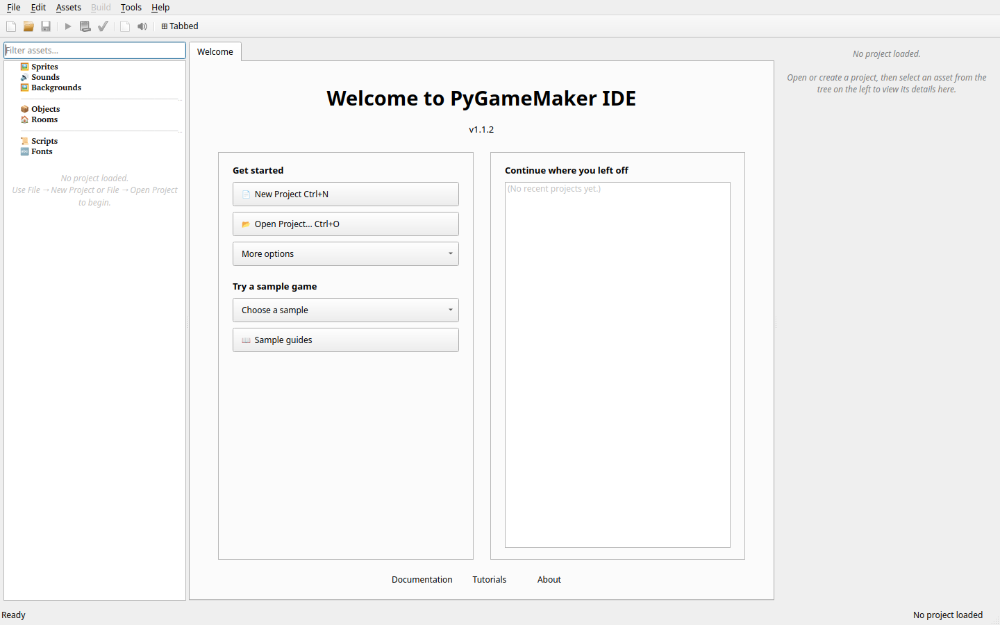

# Démarrage

> [English](Getting-Started) | [Français](Demarrage_fr) | [Deutsch](Erste_Schritte_de) | [Italiano](Iniziare_it) | [Español](Empezar_es) | [Português](Comecar_pt) | [Slovenščina](Zacetek_sl) | [Українська](Pochatok_uk) | [Русский](Nachalo_ru)

---

> [Retour à l'accueil](Home_fr)

Ce guide vous aidera à installer et lancer PyGameMaker sur votre système.

---

## Configuration requise

- **Python** 3.10 ou supérieur
- **Système d'exploitation :** Windows, Linux ou macOS
- **Espace disque :** ~500 Mo pour l'installation
- **RAM :** 4 Go minimum, 8 Go recommandé

---

## Installation

### Étape 1 : Installer Python

Téléchargez Python 3.10+ depuis [python.org](https://www.python.org/downloads/) et installez-le. Assurez-vous de cocher « Ajouter Python au PATH » lors de l'installation sur Windows.

### Étape 2 : Cloner le dépôt

```bash
git clone https://github.com/Gabe1290/pythongm.git
cd pythongm
```

Ou téléchargez le fichier ZIP depuis la [page des releases](https://github.com/Gabe1290/pythongm/releases).

### Étape 3 : Créer un environnement virtuel

```bash
python -m venv venv
```

Activez l'environnement virtuel :

**Windows :**
```bash
venv\Scripts\activate
```

**Linux/macOS :**
```bash
source venv/bin/activate
```

### Étape 4 : Installer les dépendances

```bash
pip install -r requirements.txt
```

### Étape 5 : Lancer PyGameMaker

```bash
python main.py
```

---

## Premier lancement

Au premier lancement de PyGameMaker, vous verrez :

1. **Barre de menu** - Fichier, Édition, Ressources, Compiler, Outils et Aide
2. **Arbre des ressources** - Panneau gauche montrant les ressources du projet
3. **Espace de travail** - Zone centrale pour éditer les ressources
4. **Panneau des propriétés** - Panneau droit pour les propriétés



---

## Changer de langue

PyGameMaker prend en charge plusieurs langues :

1. Allez dans **Outils > Langue**
2. Sélectionnez votre langue préférée dans le menu
3. Redémarrez PyGameMaker pour appliquer le changement

Langues disponibles : anglais, français, allemand, italien, espagnol, portugais, slovène, ukrainien, russe

---

## Prochaines étapes

- [[Premier_Jeu_fr]] - Créez votre premier jeu étape par étape
- [[Editeur_Objets_fr]] - Apprenez à créer des objets
- [[Editeur_Salles_fr]] - Concevez vos niveaux
- [[Evenements_Actions_fr]] - Comprenez la logique du jeu
- [[FAQ_fr]] - Questions fréquemment posées
