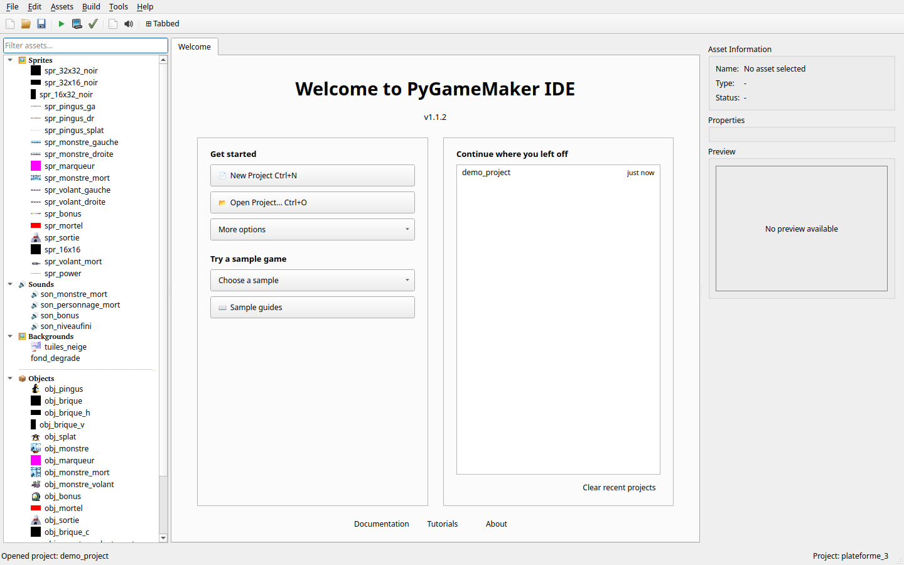

# PyGameMaker IDE

> **Select your language / Choisissez votre langue / Wählen Sie Ihre Sprache:**
>
> [English](Home) | [Français](Home_fr) | [Deutsch](Home_de) | [Italiano](Home_it) | [Español](Home_es) | [Português](Home_pt) | [Slovenščina](Home_sl) | [Українська](Home_uk) | [Русский](Home_ru)

---

**Визуальная среда разработки игр, вдохновлённая GameMaker 7.0**

PyGameMaker — это IDE с открытым исходным кодом, которая делает создание 2D-игр доступным благодаря визуальному блочному программированию (Google Blockly) и системе событий-действий. Создавайте игры без глубоких знаний программирования, а затем экспортируйте их для Windows, Linux, HTML5 или мобильных платформ.



---

## Выберите Свой Уровень

PyGameMaker использует **пресеты** для контроля доступных событий и действий. Это помогает начинающим сосредоточиться на основных функциях, позволяя опытным пользователям получить доступ к полному набору инструментов.

| Пресет | Подходит Для | Функции |
|--------|--------------|---------|
| [**Начинающий**](Beginner-Preset_ru) | Новичков в разработке игр | Основное — движение, столкновения, счёт, комнаты |
| [**Средний**](Intermediate-Preset_ru) | Некоторый опыт | Добавляет жизни, здоровье, звук, будильники, рисование |
| **Продвинутый (Полный)** | Опытных пользователей | Всё — все 37 событий и 109 действий |

**Новые пользователи:** Начните с [Пресета для Начинающих](Beginner-Preset_ru), чтобы изучить основы без перегрузки.

См. [Руководство по Пресетам](Preset-Guide_ru) для полного обзора системы пресетов.

---

## Функции на Один Взгляд

| Функция | Описание |
|---------|----------|
| **Визуальное Программирование** | Кодирование перетаскиванием с Google Blockly 12.x |
| **Система Событий-Действий** | Логика на основе событий, совместимая с GameMaker 7.0 |
| **Пресеты по Уровням** | Наборы функций для Начинающих, Средних и Продвинутых |
| **2.5D / Вид от первого лица** | Необязательный рендеринг raycast в стиле Doom/Wolfenstein — см. [3D-вид](3D-View_ru) |
| **Мультиплатформный Экспорт** | Windows EXE, приложение macOS, HTML5, Linux, Kivy (мобильный/десктоп) |
| **Управление Ресурсами** | Спрайты, звуки, фоны, шрифты и комнаты |
| **Многоязычный Интерфейс** | Английский, Французский, Немецкий, Итальянский, Испанский, Португальский, Словенский, Украинский, Русский |
| **Расширяемость** | Система [расширений](Extensions_ru) и плагинов для пользовательских действий и движков рендеринга |

---

## Начало Работы

### Системные Требования

- **Python** 3.10 или новее
- **Операционная Система:** Windows, Linux или macOS

### Установка

1. Клонируйте репозиторий:
   ```bash
   git clone https://github.com/Gabe1290/pythongm.git
   cd pythongm
   ```

2. Создайте виртуальное окружение (рекомендуется):
   ```bash
   python -m venv venv
   source venv/bin/activate  # Linux/macOS
   # или
   venv\Scripts\activate     # Windows
   ```

3. Установите зависимости:
   ```bash
   pip install -r requirements.txt
   ```

4. Запустите PyGameMaker:
   ```bash
   python main.py
   ```

---

## Основные Концепции

### Объекты
Игровые сущности со спрайтами, свойствами и поведением. Каждый объект может иметь несколько событий с связанными действиями.

### События
Триггеры, выполняющие действия при наступлении определённых условий:
- **Create** - Когда экземпляр создан
- **Step** - Каждый кадр (обычно 60 FPS)
- **Draw** - Фаза пользовательского рендеринга
- **Destroy** - Когда экземпляр уничтожен
- **Keyboard** - Клавиша нажата, отпущена или удерживается
- **Mouse** - Клики, движение, вход/выход
- **Collision** - Когда экземпляры касаются
- **Alarm** - Таймеры обратного отсчёта (12 доступных)

См. [Справочник Событий](Event-Reference_ru) для полной документации.

### Действия
Операции, выполняемые при срабатывании событий. **109** встроенных действий для:
- Движения и физики
- Рисования и спрайтов
- Счёта, жизней и здоровья
- Звука и музыки
- Управления экземплярами и комнатами
- 3D-вида (первополосный рендеринг raycast)

См. [Полный Справочник Действий](Full-Action-Reference_ru) для полного, всегда актуального списка.

### Комнаты
Игровые уровни, где вы размещаете экземпляры объектов, устанавливаете фоны и определяете игровую область.

---

## Визуальное Программирование с Blockly

PyGameMaker интегрирует Google Blockly для визуального программирования. Блоки организованы в категории:

- **События** - Create, Step, Draw, Keyboard, Mouse
- **Движение** - Скорость, направление, позиция, гравитация
- **Тайминг** - Будильники и задержки
- **Рисование** - Фигуры, текст, спрайты
- **Счёт/Жизни/Здоровье** - Отслеживание состояния игры
- **Экземпляр** - Создание и уничтожение объектов
- **Комната** - Навигация и управление
- **Значения** - Переменные и выражения
- **Звук** - Воспроизведение аудио
- **Вывод** - Отладка и отображение

---

## Опции Экспорта

### Windows EXE
Автономные исполняемые файлы Windows с использованием PyInstaller. Python не требуется на целевой машине.

### Приложение macOS
Нативные пакеты `.app` для macOS через PyInstaller.

### HTML5
Веб-игры в одном файле, работающие в любом современном браузере. Сжаты gzip для быстрой загрузки.

### Linux
Нативные исполняемые файлы Linux для сред Python 3.10+.

### Kivy
Кроссплатформенные приложения для мобильных (iOS/Android) и десктопа через Buildozer.

См. [Экспорт Игр](Eksport_Igr_ru) для деталей и обратите внимание, что любое
действие, которое цель не может воспроизвести, сообщается после экспорта (никогда
не отбрасывается молча).

---

## Структура Проекта

```
название_проекта/
├── project.json      # Конфигурация проекта
├── backgrounds/      # Фоновые изображения и метаданные
├── data/             # Пользовательские файлы данных
├── fonts/            # Определения шрифтов
├── objects/          # Определения объектов (JSON)
├── rooms/            # Макеты комнат (JSON)
├── scripts/          # Пользовательские скрипты
├── sounds/           # Аудиофайлы и метаданные
├── sprites/          # Изображения спрайтов и метаданные
└── thumbnails/       # Сгенерированные миниатюры ресурсов
```

---

## Содержание Вики

### Пресеты и Справочники
- [Руководство по Пресетам](Preset-Guide_ru) - Обзор системы пресетов
- [Пресет для Начинающих](Beginner-Preset_ru) - Основные функции для новых пользователей
- [Пресет для Средних](Intermediate-Preset_ru) - Дополнительные функции
- [Справочник Событий](Event-Reference_ru) - Полная документация событий
- [Справочник Действий](Full-Action-Reference_ru) - Полная документация действий

### Расширенные Возможности
- [3D-вид](3D-View_ru) - Первополосный рендеринг в стиле Doom (raycast)
- [Расширения](Extensions_ru) - Дополнительные действия и движки рендеринга (как поставляется 3D-вид)

### Руководства
- [Редактор Объектов](Redaktor_Obektov_ru) - Работа с игровыми объектами
- [Редактор Комнат](Redaktor_Komnat_ru) - Проектирование уровней
- [Редактор Спрайтов](Sprite-Editor_ru) - Рисование и анимация спрайтов
- [Редактор Кода](Code-Editor_ru) - Написание (и генерация) настоящего Python для объекта
- [События и Действия](Sobytiya_i_Deystviya_ru) - Справочник игровой логики
- [Визуальное Программирование](Vizualnoe_Programmirovanie_ru) - Использование блоков Blockly
- [Управление Ресурсами](Asset-Manager_ru) - Отслеживание использования, Корзина, поиск неиспользуемых/осиротевших файлов
- [Экспорт Игр](Eksport_Igr_ru) - Сборка для разных платформ
- [Горячие Клавиши](Keyboard-Shortcuts_ru) - Справочник горячих клавиш редактора
- [Устранение Неполадок](Troubleshooting_ru) - Распространённые проблемы и где искать
- [FAQ](FAQ_ru) - Часто задаваемые вопросы

### Уроки
- [**Уроки**](Tutorials_ru) - Все уроки в одном месте
- [Начало Работы](Nachalo_ru) - Первые шаги с PyGameMaker
- [Создайте Свою Первую Игру](Pervaya_Igra_ru) - Пошаговое руководство
- [Руководство Pong](Tutorial-Pong_ru) - Создайте классическую игру Pong для двух игроков
- [Руководство Breakout](Tutorial-Breakout_ru) - Создайте классическую игру Breakout
- [Руководство Sokoban](Tutorial-Sokoban_ru) - Создайте головоломку с толканием ящиков
- [Руководство Лабиринт](Tutorial-Maze_ru) - Пройдите по коридорам к выходу
- [Руководство Платформер](Tutorial-Platformer_ru) - Бегайте, прыгайте и собирайте монеты
- [Руководство Лунная Посадка](Tutorial-LunarLander_ru) - Посадите корабль на Луну
- [Введение в Создание Игр](Getting-Started-Breakout_ru) - Полное руководство для начинающих

### Где найти...?

Документация PyGameMaker разделена на три раздела, каждый из которых отвечает на свой тип вопросов:

| Если вы хотите... | Смотрите здесь |
|---|---|
| Углублённо изучить концепцию или функцию (редакторы, события, действия, экспорт) | **Эту вики** |
| Пройти пошаговый урок прямо в приложении | Панель **Руководства** в IDE (`Справка > Руководства`) — программа из 9 уроков, от первого проекта до полноценной игры с победой/поражением |
| Разобраться в конкретном примере проекта (`samples/`), поставляемом с PyGameMaker | Собственное **руководство** этого примера — нажмите **📖 Руководства по примерам** на вкладке приветствия; каждый пример включает `README.md` (переведённый на соответствующий язык), написанный специально для него |

---

## Вклад

Отчёты об ошибках, запросы на функции и pull request'ы приветствуются
на [трекере проблем](https://github.com/Gabe1290/pythongm/issues).

---

## Лицензия

Исходный код PyGameMaker распространяется под **лицензией MIT**.  Документация распространяется под **CC BY 4.0**.

Gabriel Thullen, 2025-2026

---

## Ссылки

- [GitHub Репозиторий](https://github.com/Gabe1290/pythongm)
- [Трекер Проблем](https://github.com/Gabe1290/pythongm/issues)
- [Релизы](https://github.com/Gabe1290/pythongm/releases)
