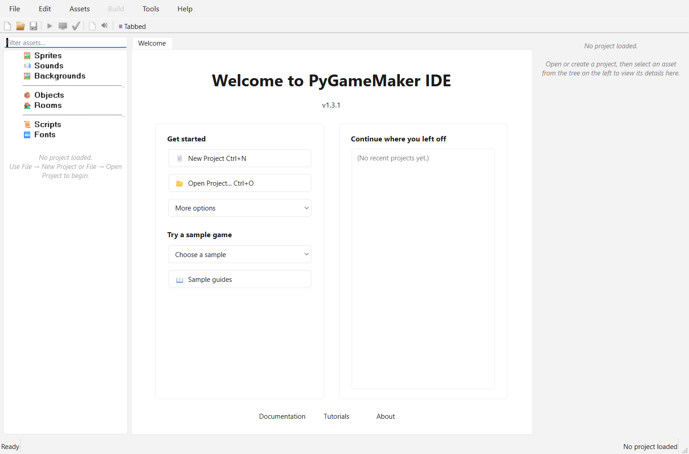

# PyGameMaker — Tutorial 1: First Steps

*[Home](Home) | [Teacher resources](Teacher-Resources)*

**Download:** [PDF](downloads/Student-Handout-01-getting-started.pdf) · [ODT](downloads/Student-Handout-01-getting-started.odt)

---

## How to Use This Handout

This handout follows the 4 pages of the in-app tutorial, found under
**Help > Tutorials > First Steps**. Read each part here, then do the
matching part on your screen. Tick the checkboxes as you complete each
task, and use the **My Notes** section at the end to write down
anything you want to remember.

## Part 1: Welcome to PyGameMaker

PyGameMaker is a visual game-making program. You build 2D games by
creating **assets** — sprites (images), objects (things that are
programmed to behave a certain way), and rooms (levels) — and
connecting them together. By the end of this tutorial, you will be
able to:

- Navigate the PyGameMaker interface confidently
- Create and manage game assets (sprites, objects, rooms)
- Add behaviors to game objects using events and actions
- Test and export your own games

> **Tip:** You can close the tutorial panel at any time with the "Close"
> button at the top. To open it again later, use **Help > Tutorials**
> from the menu.

- **Title Bar**
- **Close**
- **Fullscreen**
- **Minimize**
- **Menu Bar**
- **Toolbar**
- **Assets**
- **Editor Area**
- **Properties**

## Part 2: The PyGameMaker Interface

Before building anything, take a moment to look around. The
PyGameMaker window is divided into three main areas.

### 1. Asset Tree (left panel)

This is where every asset in your project lives, organized by type:

- **Sprites** — the images and animations your game uses
- **Sounds** — sound effects and music
- **Objects** — the game entities that actually do things
- **Rooms** — the levels or screens of your game

Right-click any category here to create a new asset of that type.

### 2. Editor Area (center)

This is where you actually edit things. Double-click an asset in the
tree, and its editor opens here in a tab:

- The **Sprite Editor** lets you view and draw sprites
- The **Object Editor** lets you define what an object does, using events
- The **Room Editor** lets you design a level by placing objects in it

### 3. Properties Panel (right panel)

Shows the settings of whatever you currently have selected. When you
are editing a room or an object, this is where you change its details.

### Key Menus

- **File** — create, open, and save projects
- **Assets** — create and import game assets
- **Build** — test and export your game
- **Help** — tutorials and documentation

> **Tip:** Press **F5**, or click the green triangle in the toolbar, at
> any time to quickly test your game!

## Part 3: Build Your First Project

Now it is time to build something! Follow these six steps in order,
and each one explains what you are doing and why, before telling you
what to click.

- [ ] **1. Create a new project.** Every game starts as a project, which is a folder that holds all of its assets. Go to **File > New Project** (or press **Ctrl+N**), give your project a name, and choose where to save it.
- [ ] **2. Create a sprite.** A sprite is the image your character (or any object) will use. Right-click **Sprites**, choose **Create New Sprite**, and name it `spr_player`. Then either draw a simple character in the Sprite Editor, or right-click it and choose **Import Image...** to use an existing picture.
- [ ] **3. Create an object.** A sprite is just a picture carried by an object — an object is what actually behaves in your game. Right-click **Objects**, choose **Create New Object**, name it `obj_player`, and assign it the sprite you just made in its properties.
- [ ] **4. Create a room.** A room is a level or screen in your game. Right-click **Rooms**, choose **Create New Room**, and name it `room_game`. This will be your very first level.
- [ ] **5. Place an object.** An object only appears in the game once it has been placed in a room. Double-click your room to open the Room Editor, select `obj_player` from the list, and click inside the room to place it.
- [ ] **6. Test the game.** Press **F5** (or click the green triangle icon in the toolbar, or go to **Build > Test Game**). A window will open showing your room, with the object you placed inside it!

> **Done:** Congratulations! You have just created your first PyGameMaker
> project. It doesn't do much yet — your object won't move or react to
> anything — but you will learn how to add behaviors in the next
> tutorials.

## Part 4: A Look Ahead

Now that you know the basics, here is a preview of what is coming
next. You do not need to do any of this today — just read it so you
know what to look forward to.

- **Adding movement** — using a Keyboard event and actions like "Move in Direction" to make your object respond to key presses
- **Collision detection** — making objects react when they touch each other, like stopping at a wall
- **Visual programming with Blockly** — building behaviors by connecting blocks to each other instead of writing code
- **Multiple rooms** — creating several levels and moving between them
- **Exporting your game** — turning your finished project into a game other people can play, for example as a web page or an executable file

> **Info:** Need help? Ask your teacher, or press **F1** in PyGameMaker for
> documentation.

## Vocabulary

| Term | What it means |
|---|---|
| Asset | Any resource in your project — a sprite, sound, object, or room |
| Sprite | An image (or animation) used to draw something on screen |
| Object | A game entity — what actually appears and behaves in a room |
| Room | A level or screen in your game, where objects are placed |

## My Notes

 

 

 

 

 

 

