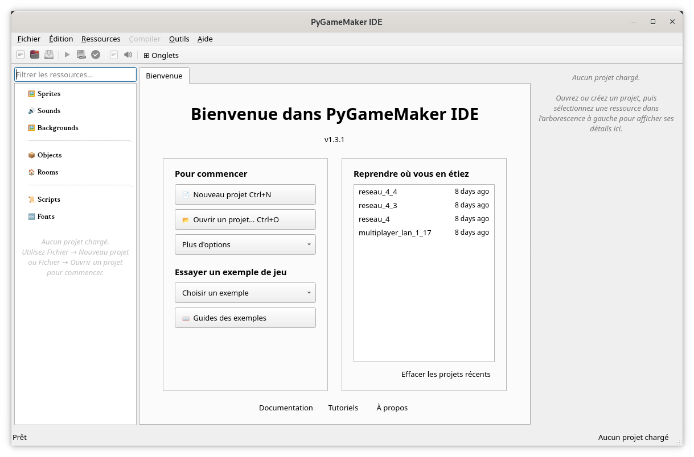

# PyGameMaker — Tutoriel 1 : Premiers pas

*[Accueil](Home_fr) | [Ressources pour enseignants](Teacher-Resources_fr)*

**Télécharger :** [PDF](downloads/Student-Handout-01-getting-started_fr.pdf) · [ODT](downloads/Student-Handout-01-getting-started_fr.odt)

---

## Comment utiliser cette fiche

Cette fiche suit les 4 pages du tutoriel intégré, disponible dans
**Aide > Tutoriels > Premiers pas**. Lis chaque partie ici, puis fais la
partie correspondante sur ton écran. Coche les cases au fur et à
mesure, et utilise la section **Mes notes** à la fin pour écrire ce que
tu veux retenir.

## Partie 1 : Bienvenue dans PyGameMaker

PyGameMaker est un logiciel de création de jeux vidéo visuel. Tu
construis des jeux 2D en créant des **ressources** — des sprites
(images), des objets (des éléments qui sont programmés pour se
comporter d'une certaine façon) et des salles (les niveaux) — puis en
les reliant entre elles. À la fin de ce tutoriel, tu seras capable de :

- Naviguer dans l'interface de PyGameMaker en toute confiance
- Créer et gérer les ressources du jeu (sprites, objets, salles)
- Ajouter des comportements aux objets en utilisant des événements et des actions
- Tester et exporter tes propres jeux

> **Astuce:** Tu peux fermer le panneau de tutoriel à tout moment avec le
> bouton « Fermer » en haut. Pour le rouvrir plus tard, utilise
> **Aide > Tutoriels** dans le menu.

- **Barre de Titre**
- **Fermer**
- **Plein écran**
- **Minimiser**
- **Barre des Menus**
- **Barre d'icônes**
- **Ressources**
- **Zone d'édition**
- **Propriétés**

## Partie 2 : L'interface de PyGameMaker

Avant de construire quoi que ce soit, prends un moment pour regarder la
fenêtre de PyGameMaker qui est divisée en trois zones principales :

### 1. Arborescence des ressources (panneau gauche)

C'est ici sont affichées toutes les ressources de ton projet,
organisées par type :

Fais un clic droit sur une catégorie pour créer une nouvelle ressource
de ce type.

- **Sprites** — les images et animations utilisées par ton jeu
- **Sons** — effets sonores et musique
- **Objets** — les entités du jeu qui font réellement quelque chose
- **Salles** — les niveaux ou écrans de ton jeu

### 2. Zone d'édition (centre)

C'est ici que tu édites les ressources. Double-clique sur une ressource
dans l'arborescence, et son éditeur s'ouvre ici dans un onglet :

- L'**éditeur de sprites** permet de visualiser et dessiner des sprites
- L'**éditeur d'objets** permet de définir ce que fait un objet, à l'aide d'événements
- L'**éditeur de salles** permet de concevoir un niveau en y plaçant des objets

### 3. Panneau des propriétés (panneau droit)

Affiche les réglages de l'élément actuellement sélectionné. Quand tu
édites une salle ou un objet, c'est ici que tu modifies certaines
propriétés.

### Menus principaux

- **Fichier** — créer, ouvrir et enregistrer des projets
- **Ressources** — créer et importer des ressources de jeu
- **Compilation** — tester et exporter ton jeu
- **Aide** — tutoriels et documentation

> **Astuce:** Appuye sur le triangle vert ou sur la touche **F5** à tout
> moment pour tester rapidement votre jeu !

## Partie 3 : Crée ton premier projet

C'est maintenant le moment de construire quelque chose ! Suis ces six
étapes dans l'ordre, et chacune explique ce que tu fais et pourquoi,
avant de te dire sur quoi cliquer.

- [ ] **1. Créer un nouveau projet.** Chaque jeu commence par un projet, qui est un dossier contenant toutes ses ressources. Vas dans **Fichier > Nouveau projet** (ou appuye sur **Ctrl+N**), donne un nom à ton projet et choisis où l'enregistrer.
- [ ] **2. Créer un sprite.** Un sprite est l'image qu'utilisera ton personnage (ou tout autre objet). Fais un clic droit sur **Sprites**, choisis **Créer un sprite**, et nomme-le `spr_player`. Importe ensuite une image existante, ou dessine un personnage simple dans l'éditeur de sprites.
- [ ] **3. Créer un objet.** Un sprite n'est qu'une image porté par un objet — un objet est ce qui se comporte réellement dans ton jeu. Fais un clic droit sur **Objets**, choisis **Créer un objet**, nomme-le `obj_player`, et assigne-lui le sprite que tu viens de créer dans ses propriétés.
- [ ] **4. Créer une salle.** Une salle est un niveau de ton jeu ou l'écran de ton jeu. Fais un clic droit sur **Salles**, choisis **Créer une salle**, et nomme-la `room_game`. Ce sera ton tout premier niveau.
- [ ] **5. Placer un objet.** Un objet n'apparaît dans le jeu qu'une fois placé dans une salle. Double-clique sur ta salle pour ouvrir l'éditeur de salles, sélectionne `obj_player` dans la liste, puis clique dans la salle pour le placer.
- [ ] **6. Tester le jeu.** Appuye sur **F5** (ou clique sur le triangle vert dans la barre d'icônes, ou vas dans **Compilation > Tester le jeu**). Une fenêtre s'ouvrira montrant ta salle, avec l'objet que tu as placé dedans !

> **Réussi:** Félicitations ! Tu viens de créer ton premier projet
> PyGameMaker. Il ne fait pas encore grand-chose — ton objet ne
> bougera pas et ne réagira à rien — mais tu apprendras à ajouter des
> comportements dans les prochains tutoriels.

## Partie 4 : Un aperçu de la suite

Maintenant que tu connais les bases, voici un aperçu de ce qui arrive
ensuite. Tu n'as rien à faire tout de suite — lis juste cette partie
pour savoir ce qui t'attend.

- **Ajouter du mouvement** — utiliser un événement Clavier et des actions comme « Déplacer dans une direction » pour que ton objet réagisse aux touches
- **Détection des collisions** — faire réagir les objets quand ils se touchent, par exemple s'arrêter devant un mur
- **Programmation visuelle avec Blockly** — construire des comportements en connectant des blocs entre eux au lieu d'écrire du code
- **Salles multiples** — créer plusieurs niveaux et passer de l'un à l'autre
- **Exporter votre jeu** — transformer ton projet terminé en un jeu que d'autres personnes peuvent jouer, par exemple sous forme de page web ou de fichier exécutable

> **Info:** Besoin d'aide ? Demandez à ton enseignant·e, ou appuyez sur
> **F1** dans PyGameMaker pour ouvrir la documentation.

## Vocabulaire

| Terme | Ce que cela signifie |
|---|---|
| Ressource (Asset) | Tout élément de ton projet — un sprite, un son, un objet ou une salle |
| Sprite | Une image (ou animation) utilisée pour dessiner quelque chose à l'écran |
| Objet | Une entité de jeu — ce qui apparaît et se comporte réellement dans une salle |
| Salle | Un niveau ou un écran de ton jeu, où l'on place les objets |

## Mes notes

 

 

 

 

 

 

