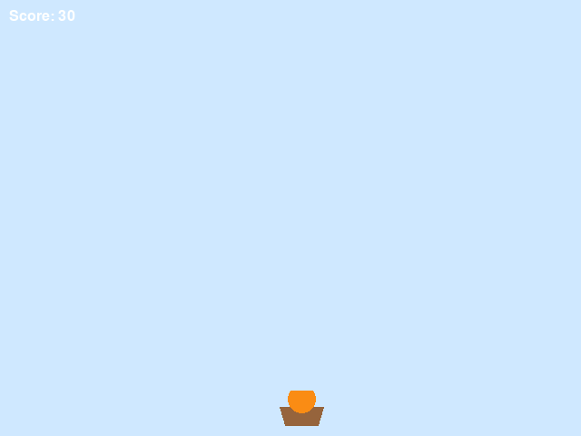

# PyGameMaker — Tutoriel 15 : Fusion de Fruits

*[Accueil](Home_fr) | [Ressources pour enseignants](Teacher-Resources_fr)*

**Télécharger :** [PDF](downloads/Student-Handout-15-fruit-fusion_fr.pdf) · [ODT](downloads/Student-Handout-15-fruit-fusion_fr.odt)

---

## Comment utiliser cette fiche

Cette fiche accompagne le tutoriel intégré **Aide > Tutoriels > Fusion de Fruits : Attrape et Fusionne !** (5 pages, environ 20 à 25 minutes). Garde le tutoriel ouvert sur une moitié de ton écran. Coche chaque case quand l'étape est faite, et vérifie la ligne **Tu dois voir** à la fin de chaque phase. Si quelque chose ne correspond pas, regarde **Bloqué·e ?** avant d'appeler ton enseignant·e.

## Ce que tu vas créer

Un panier qui tient toujours un seul fruit, en commençant par une cerise. Des cerises, des fraises et des oranges tombent du ciel. Attrape un fruit qui correspond à ce que tu tiens et il fusionne en un fruit plus gros, le suivant. Fusionne jusqu'à obtenir une pastèque et tu gagnes !

## Phase 1 : Le panier mobile

- [ ] **1.** Crée un nouveau projet `FruitFusion`.
- [ ] **2.** Crée un sprite `spr_basket_empty` (56x40, un panier marron) et un objet `obj_player` avec ce sprite.
- [ ] **3.** Crée une salle `room_main` et place `obj_player` près du centre, en bas.
- [ ] **4.** Dans `obj_player` : **Clavier : Flèche gauche (maintenue)** avec *Définir vitesse horizontale à -5* ; **Flèche droite (maintenue)** avec *5* ; **Clavier : Aucune touche** avec *Arrêter le mouvement*.

> **Réussi:** **Tu dois voir :** appuie sur **F5**. Gauche et Droite déplacent le panier, et il s'arrête quand tu relâches.

## Phase 2 : Première fusion

- [ ] **5.** Crée un sprite `spr_fruit_cherry` (20x20, un cercle rouge) et un objet `obj_fruit_cherry` avec un événement **Quand créé** (*Définir vitesse verticale à 3*) et un événement **Hors de la salle** (*Détruire cette instance*).
- [ ] **6.** Crée `obj_spawn_cherry` (sans sprite) avec un événement **Quand créé** (*Définir l'alarme 0 à 90*) et un événement **Alarme 0** (*Créer une instance de obj_fruit_cherry à x aléatoire, y 0*, puis *Définir l'alarme 0 à 90* à nouveau). Place-en une dans `room_main`.
- [ ] **7.** Change le sprite de `obj_player` vers un nouveau sprite `spr_basket_cherry` (un panier avec une cerise dedans) — le panier commence maintenant en tenant déjà une cerise.
- [ ] **8.** Dans `obj_player` : l'événement **Quand créé** fait *Définir le score à 0* et *Définir la variable held_level à 1* ; l'événement **Quand dessiner** fait *Dessiner le score à x 10, y 10*.
- [ ] **9.** Ajoute **Quand collision avec obj_fruit_cherry** : *Si held_level est égal à 1 alors* [*définir held_level à 2*, *ajouter 10 au score*, *définir le sprite à spr_basket_strawberry*] *Sinon* [*ajouter 1 au score*] ; puis *Détruire l'autre instance*.

> **Réussi:** **Tu dois voir :** appuie sur **F5**. Attrape une cerise qui tombe — le panier devient une fraise et le score bondit de 10.

## Phase 3 : Deuxième fusion

Cette phase répète exactement la même recette que la Phase 2, avec « cerise » changé en « fraise » et les nombres changés de 1/2 à 2/3.

- [ ] **10.** Crée un sprite `spr_fruit_strawberry` (26x26, un cercle rose-rouge) et un objet `obj_fruit_strawberry`, construit exactement comme `obj_fruit_cherry`.
- [ ] **11.** Crée `obj_spawn_strawberry` (alarme 0 à 120 cette fois) et place-en un dans `room_main`.
- [ ] **12.** Ajoute **Quand collision avec obj_fruit_strawberry** sur `obj_player` : *Si held_level est égal à 2 alors* [*définir held_level à 3*, *ajouter 20 au score*, *définir le sprite à spr_basket_orange*] *Sinon* [*ajouter 1 au score*] ; puis *Détruire l'autre instance*.

> **Réussi:** **Tu dois voir :** appuie sur **F5**. Attrape une cerise, puis une fraise — le panier devient une orange, avec un score de 30 points.

## Phase 4 : Gagner la partie

- [ ] **13.** Crée un sprite `spr_fruit_orange` (32x32, un cercle orange) et un objet `obj_fruit_orange`, construit exactement comme les autres. Il n'y a pas de sprite ni de générateur de pastèque qui tombe — une pastèque n'est jamais qu'une chose que ton panier devient.
- [ ] **14.** Crée `obj_spawn_orange` (alarme 0 à 150) et place-en un dans `room_main`.
- [ ] **15.** Crée `obj_win_text`. Événement **Quand dessiner** : *Dessiner texte* « VOUS AVEZ GAGNÉ ! Vous avez fait une pastèque ! » à x 120, y 220 et « Appuyez sur ESPACE pour rejouer » à x 190, y 260. **Touche pressée : Espace** : *Redémarrer le jeu*.
- [ ] **16.** Crée `room_win` avec une couleur d'arrière-plan vive, et place-y une instance de `obj_win_text`.
- [ ] **17.** Ajoute **Quand collision avec obj_fruit_orange** sur `obj_player` : *Si held_level est égal à 3 alors* [*définir held_level à 4*, *ajouter 50 au score*, *définir le sprite à spr_basket_watermelon*, *Aller à la salle room_win*] *Sinon* [*ajouter 1 au score*] ; puis *Détruire l'autre instance*.

> **Réussi:** **Tu dois voir :** appuie sur **F5**. Enchaîne les trois fusions et la salle VOUS AVEZ GAGNÉ ! apparaît. ESPACE lance une nouvelle partie.

## Bloqué·e ?

| Ce qui ne va pas | Cause la plus probable | Que faire |
|---|---|---|
| Le panier ne change jamais d'image | *Définir le sprite* manque dans la branche *Si*, ou le nom de sprite est faux | Vérifie le nom exact du sprite dans *Définir le sprite à* |
| Attraper un fruit qui correspond ne donne que 1 point | `held_level` n'est pas vraiment égal au nombre que le *Si* vérifie, ou l'opérateur est faux | Vérifie que *Si held_level est égal à* utilise le bon nombre pour cette phase (1, puis 2, puis 3) |
| Le panier reste bloqué sur une cerise pour toujours | La branche *Sinon* de la fusion a aussi changé `held_level` par erreur | Seule la branche *Si* doit toucher `held_level` et le sprite |
| Les fruits s'accumulent et ne disparaissent jamais | L'événement **Hors de la salle** du fruit est manquant | Ajoute *Détruire cette instance* dans Hors de la salle |
| Aucun fruit ne tombe jamais | L'objet générateur n'a aucune instance placée dans `room_main`, ou son alarme n'a jamais été réglée dans Quand créé | Place une instance du générateur ; vérifie que *Définir l'alarme 0* est bien dans **Quand créé** |
| Attraper une orange ne fait pas gagner | L'action *Aller à la salle room_win* est au mauvais endroit, ou le nom de salle est mal écrit | Elle doit être dans la branche *Si held_level est égal à 3*, orthographiée exactement `room_win` |
| L'écran de victoire est vide | `obj_win_text` n'a pas été placé dans `room_win`, ou son événement Quand dessiner est manquant | Place une instance ; vérifie que l'événement existe |
| ESPACE ne fait rien sur l'écran de victoire | La salle de victoire n'a aucun objet avec un événement **Touche pressée : Espace** | Ajoute l'événement à `obj_win_text` |

## Défis

- **Essaie (5 minutes) :** change la vitesse de chute des fruits, ou la fréquence d'un générateur.
- **Va plus loin :** ajoute un quatrième générateur et un type de fruit entre l'orange et la pastèque.
- **Invente :** ajoute des vies qui diminuent quand tu te trompes trop souvent de suite.

## Vocabulaire

| Terme | Ce que cela veut dire |
|---|---|
| Fruit tenu | Le fruit que le panier porte actuellement, dont on se souvient dans `held_level` |
| Fusion | Attraper un fruit qui correspond pour qu'il devienne le fruit suivant, plus gros |
| Si / Sinon | Un bloc qui fait une chose quand quelque chose est vrai, et une autre chose sinon |
| Générateur | Un objet invisible dont le seul rôle est de créer d'autres objets selon une minuterie |
| Hors de la salle | Un événement qui se déclenche quand une instance quitte la salle — utilisé ici pour nettoyer les fruits ratés |

## Vérifie-toi

Écris tes réponses dans les notes ci-dessous.

1. Pourquoi le panier a-t-il besoin d'une variable comme `held_level` ?
2. Que se passe-t-il si tu attrapes une cerise alors que tu tiens déjà une orange ?
3. Pourquoi n'y a-t-il aucun sprite ni générateur pour une pastèque qui tombe ?

## Mes notes

 

 

 

 

 

 

