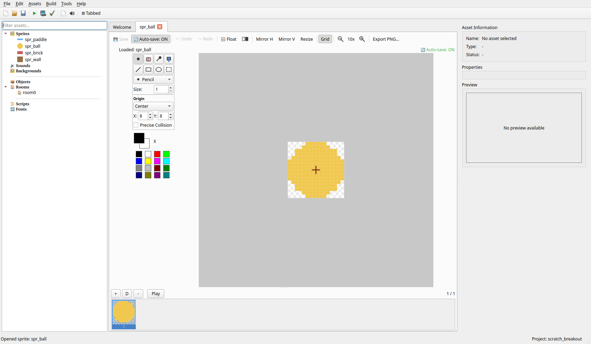
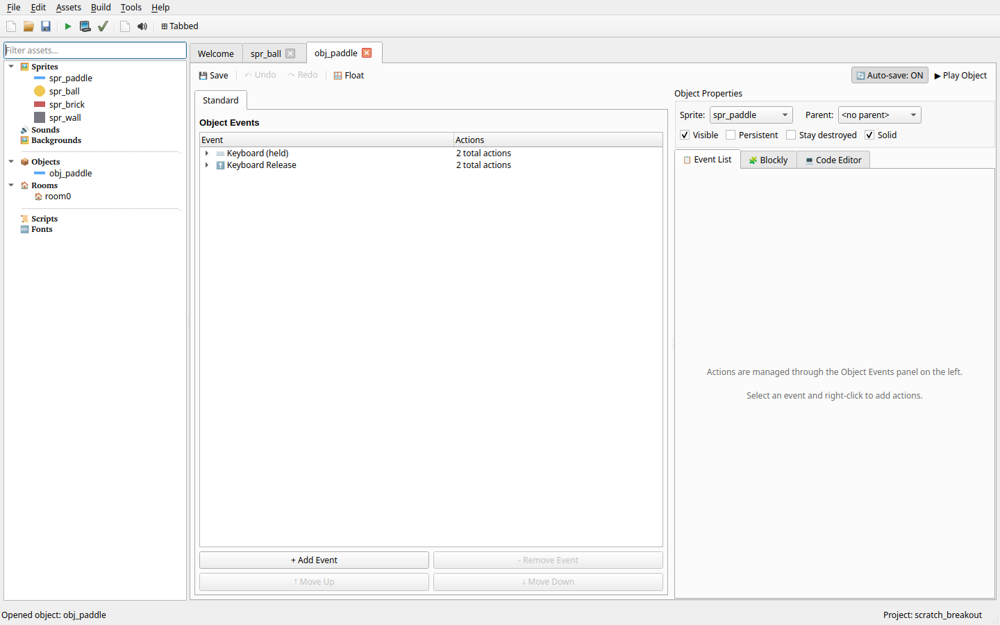
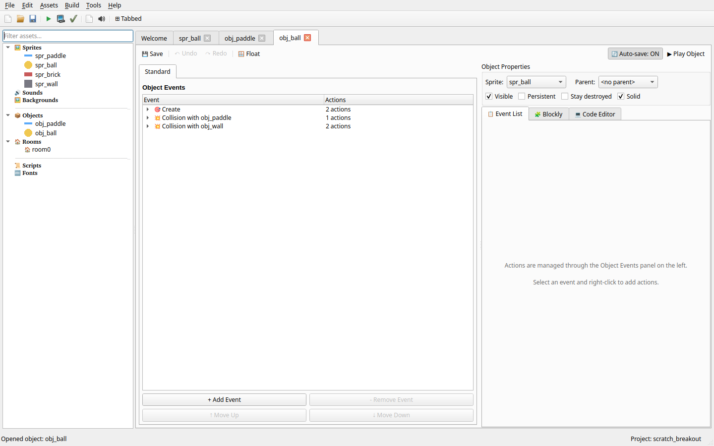
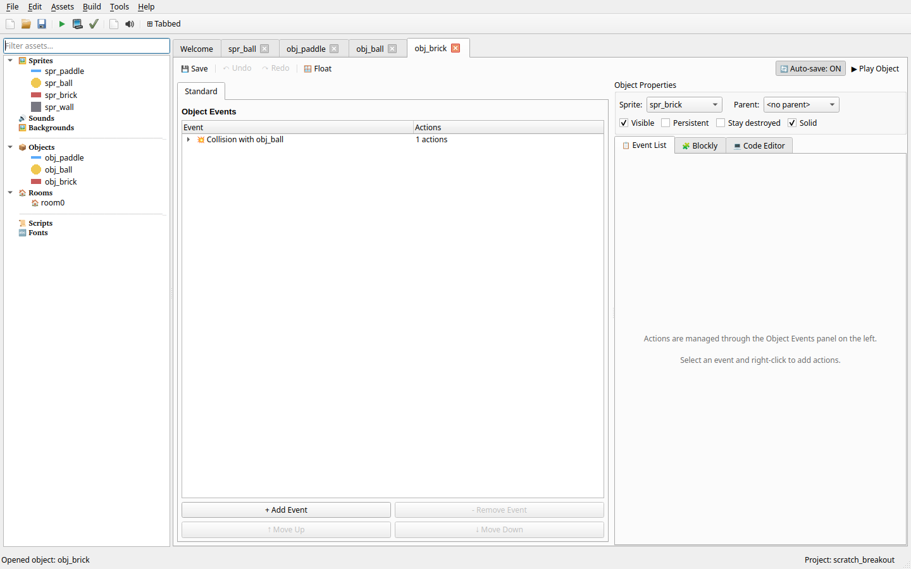
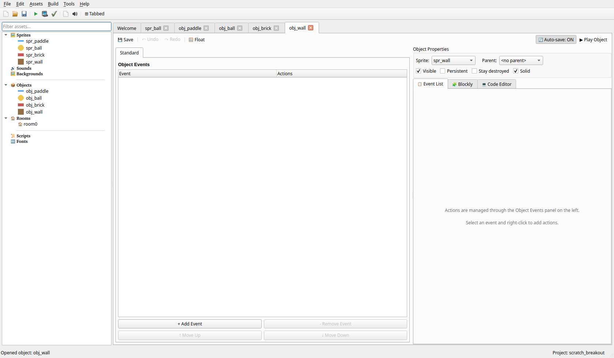
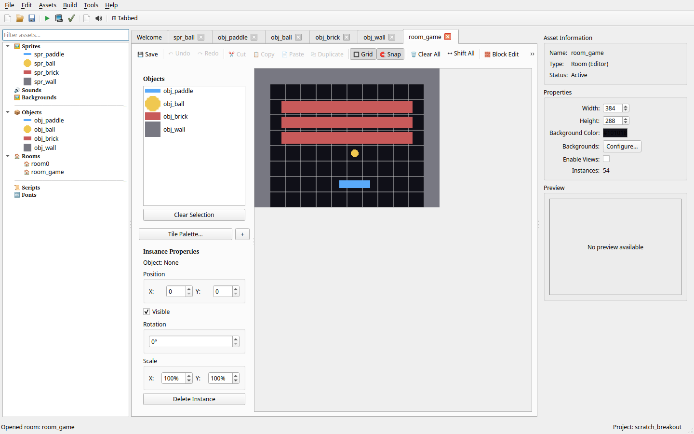

# Vadnica: Ustvari igro Breakout

*[Home](Home_sl) | [Beginner Preset](Beginner-Preset_sl) | [English](Tutorial-Breakout)*

Ta vadnica vas bo vodila skozi ustvarjanje klasične igre Breakout. Je odličen prvi projekt za učenje PyGameMaker!

---

## Kaj se boste naučili

- Ustvarjanje in uporaba sprite-ov
- Nastavitev igralnih objektov z dogodki in akcijami
- Tipkovnični kontroli za premikanje igralca
- Zaznavanje trkov in odbijanje
- Uničenje objektov ob trku
- Gradnja igralne sobe

---

## Korak 1: Ustvari sprite-e

Najprej moramo ustvariti vizualne elemente za našo igro.

### 1.1 Ustvari sprite loparja
1. V plošči **Assets** z desnim klikom na **Sprites** → **Create Sprite**
2. Poimenujte ga `spr_paddle`
3. Narišite vodoraven pravokotnik (približno 64x16 pik)
4. **Pomembno:** Kliknite **Center** za nastavitev izhodišča na sredino

### 1.2 Ustvari sprite žogice
1. Ustvarite drug sprite z imenom `spr_ball`
2. Narišite majhen krog (približno 16x16 pik)
3. Kliknite **Center** za nastavitev izhodišča

### 1.3 Ustvari sprite opeke
1. Ustvarite sprite z imenom `spr_brick`
2. Narišite pravokotnik (približno 48x24 pik)
3. Kliknite **Center** za nastavitev izhodišča

### 1.4 Ustvari sprite stene
1. Ustvarite sprite z imenom `spr_wall`
2. Narišite kvadrat (približno 32x32 pik) - to bo meja
3. Kliknite **Center** za nastavitev izhodišča

### 1.5 Ustvari ozadje (neobvezno)
1. Z desnim klikom na **Backgrounds** → **Create Background**
2. Poimenujte ga `bg_game`
3. Narišite ali naložite sliko ozadja

---

## Korak 2: Ustvari objekt loparja

Zdaj bomo programirali lopar, ki ga igralec nadzoruje.

### 2.1 Ustvari objekt
1. Z desnim klikom na **Objects** → **Create Object**
2. Poimenujte ga `obj_paddle`
3. Nastavite **Sprite** na `spr_paddle`
4. Označite polje **Solid**

### 2.2 Dodaj premikanje z desno puščico
1. Kliknite **Add Event** → **Keyboard** → izberite **Right Arrow**
2. Dodajte akcijo **Set Horizontal Speed**
3. Nastavite **value** na `5` (ali katerokoli hitrost želite)

### 2.3 Dodaj premikanje z levo puščico
1. Kliknite **Add Event** → **Keyboard** → izberite **Left Arrow**
2. Dodajte akcijo **Set Horizontal Speed**
3. Nastavite **value** na `-5`

### 2.4 Ustavi ob sproščeni tipki
Lopar se premika tudi po sproščeni tipki! Popravimo to.

1. Kliknite **Add Event** → **Keyboard Release** → izberite **Right Arrow**
2. Dodajte akcijo **Set Horizontal Speed**
3. Nastavite **value** na `0`

4. Kliknite **Add Event** → **Keyboard Release** → izberite **Left Arrow**
5. Dodajte akcijo **Set Horizontal Speed**
6. Nastavite **value** na `0`

Zdaj se lopar ustavi, ko sprostite puščične tipke.

---

## Korak 3: Ustvari objekt žogice

### 3.1 Ustvari objekt
1. Ustvarite nov objekt z imenom `obj_ball`
2. Nastavite **Sprite** na `spr_ball`
3. Označite polje **Solid**

### 3.2 Nastavi začetno gibanje
1. Kliknite **Add Event** → **Create**
2. Dodajte akcijo **Start Moving (Direction)** (ali **Set Horizontal/Vertical Speed**)
3. Nastavite diagonalno smer s hitrostjo `5`
   - Na primer: **hspeed** = `4`, **vspeed** = `-4`

To povzroči, da se žogica začne premikati ob začetku igre.

### 3.3 Odbij se od loparja
1. Kliknite **Add Event** → **Collision** → izberite `obj_paddle`
2. Dodajte akcijo **Reverse Vertical** (za odboj)

### 3.4 Odbij se od sten
1. Kliknite **Add Event** → **Collision** → izberite `obj_wall`
2. Dodajte akcijo **Reverse Horizontal** ali **Reverse Vertical** po potrebi
   - Ali uporabite obe za obravnavo odbijanja v kotih

---

## Korak 4: Ustvari objekt opeke

### 4.1 Ustvari objekt
1. Ustvarite nov objekt z imenom `obj_brick`
2. Nastavite **Sprite** na `spr_brick`
3. Označite polje **Solid**

### 4.2 Uniči ob trku z žogico
1. Kliknite **Add Event** → **Collision** → izberite `obj_ball`
2. Dodajte akcijo **Destroy Instance** s ciljem **self**

To uniči opeko, ko jo žogica zadene!

### 4.3 Odbij žogico
**Reverse Vertical** se vedno uporabi na instanci, v čigar dogodku je
— nima možnosti "uporabi na other" — zato mora ta akcija biti na
žogici, ne na opeki:

1. Vrnite se na `obj_ball` in dodajte:
2. **Add Event** → **Collision** → izberite `obj_brick`
3. Dodajte akcijo **Reverse Vertical**

---

## Korak 5: Ustvari objekt stene

### 5.1 Ustvari objekt
1. Ustvarite nov objekt z imenom `obj_wall`
2. Nastavite **Sprite** na `spr_wall`
3. Označite polje **Solid**

To je vse - stena mora biti samo trdna, da se žogica odbije.

---

## Korak 6: Ustvari igralno sobo

### 6.1 Ustvari sobo
1. Z desnim klikom na **Rooms** → **Create Room**
2. Poimenujte jo `room_game`

### 6.2 Nastavi ozadje (neobvezno)
1. V nastavitvah sobe poiščite **Background**
2. Izberite svoje ozadje `bg_game`
3. Označite **Stretch**, če želite, da zapolni sobo

### 6.3 Postavi objekte

Zdaj postavite svoje objekte v sobo:

1. **Postavi lopar:** Postavite `obj_paddle` na spodnji sredini sobe

2. **Postavi stene:** Postavite instance `obj_wall` ob robovih:
   - Vzdolž vrha
   - Vzdolž leve strani
   - Vzdolž desne strani
   - Pustite dno odprto (tu lahko žogica uide!)

3. **Postavi žogico:** Postavite `obj_ball` nekje na sredino

4. **Postavi opeke:** Razporedite instance `obj_brick` v vrstah na vrhu sobe

---

## Korak 7: Preizkusi svojo igro!

1. Kliknite gumb **Play** (zelena puščica)
2. Uporabite tipki **Levo** in **Desno** za premikanje loparja
3. Poskusite odbiti žogico, da uničite vse opeke!
4. Pritisnite **Escape** za izhod

---

## Kaj sledi?

Vaša osnovna igra Breakout je dokončana! Tukaj je nekaj izboljšav, ki jih lahko preizkusite:

### Dodaj sistem življenj
- Dodajte dogodek **No More Lives** za prikaz "Game Over"
- Izgubite življenje, ko žogica uide skozi dno

### Dodaj točke
- Uporabite akcijo **Add Score** pri uničenju opek
- Prikažite točke z **Draw Score**

### Dodaj več nivojev
- Ustvarite več sob z različnimi razporeditvami opek
- Uporabite **Next Room**, ko so vse opeke uničene

### Dodaj zvočne učinke
- Dodajte zvoke za odbijanje in uničenje opek
- Uporabite akcijo **Play Sound**

---

## Povzetek objektov

| Objekt | Sprite | Trden | Dogodki |
|--------|--------|-------|---------|
| `obj_paddle` | `spr_paddle` | Da | Keyboard (Left/Right), Keyboard Release |
| `obj_ball` | `spr_ball` | Da | Create, Collision (paddle, wall, brick) |
| `obj_brick` | `spr_brick` | Da | Collision (ball) - Uniči self |
| `obj_wall` | `spr_wall` | Da | Ni potrebno |

---

## Glejte tudi

- [Beginner Preset](Beginner-Preset_sl) - Dogodki in akcije, uporabljeni v tej vadnici
- [Event Reference](Event-Reference_sl) - Vsi razpoložljivi dogodki
- [Full Action Reference](Full-Action-Reference_sl) - Vse razpoložljive akcije
