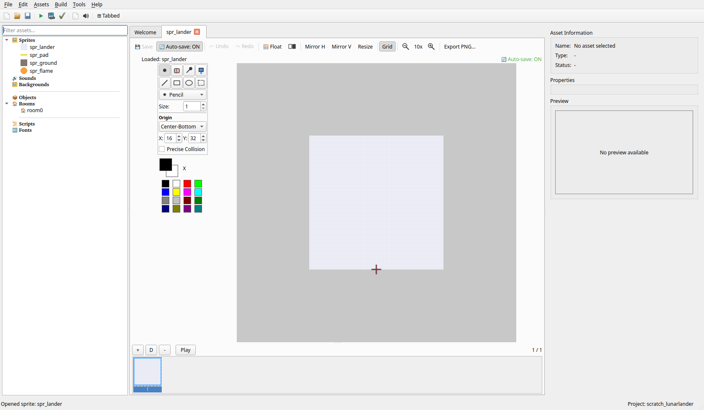
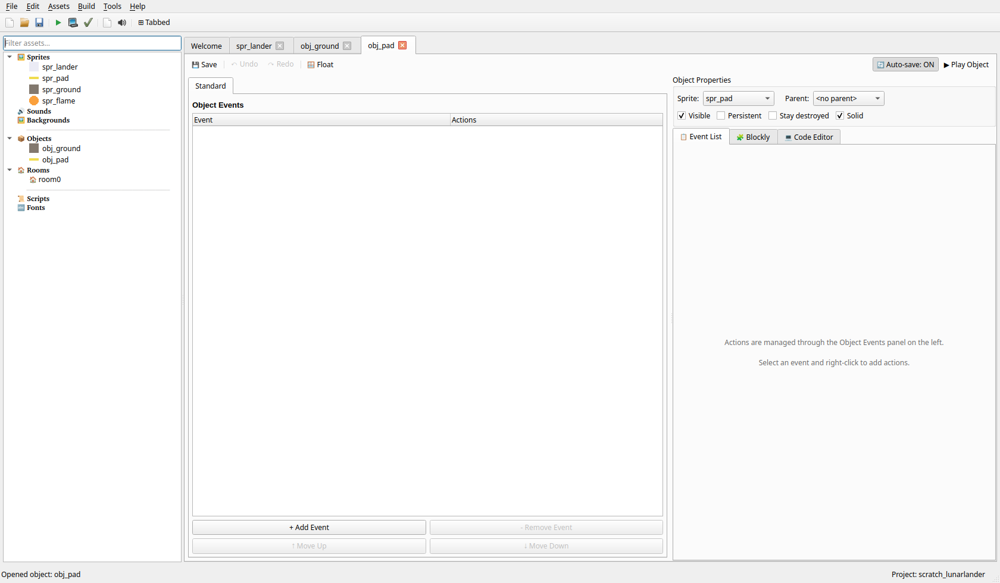
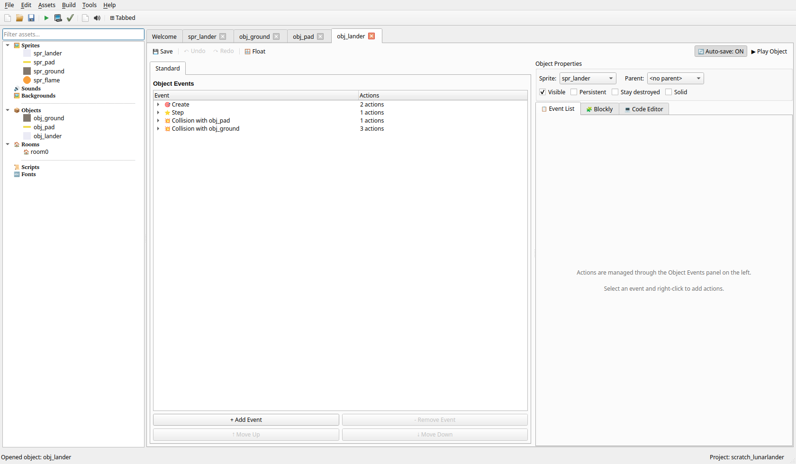
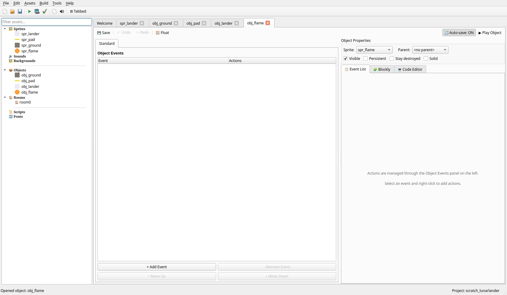
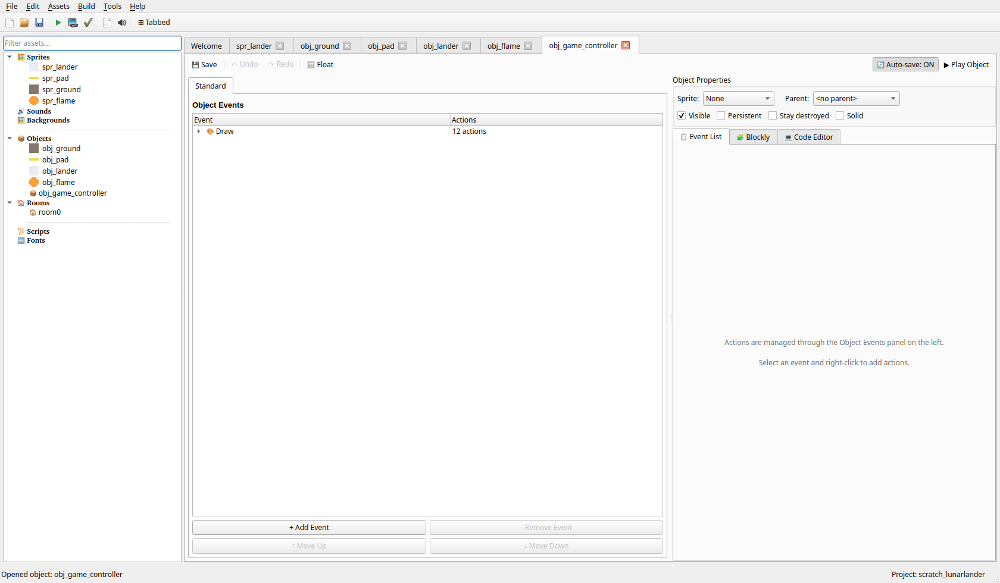
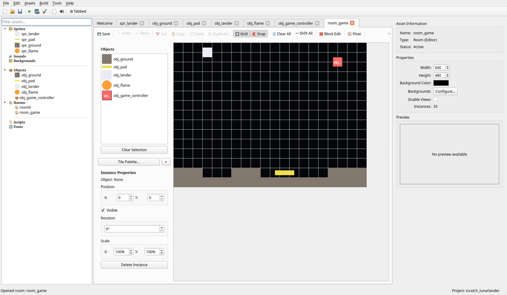

# Vodič: Ustvari Igro Pristanka na Luni

> **Select your language / Choisissez votre langue / Wählen Sie Ihre Sprache:**
>
> [English](Tutorial-LunarLander) | [Français](Tutorial-LunarLander_fr) | [Deutsch](Tutorial-LunarLander_de) | [Italiano](Tutorial-LunarLander_it) | [Español](Tutorial-LunarLander_es) | [Português](Tutorial-LunarLander_pt) | [Slovenščina](Tutorial-LunarLander_sl) | [Українська](Tutorial-LunarLander_uk) | [Русский](Tutorial-LunarLander_ru)

---

## Uvod

V tem vodiču boš ustvaril **Igro Pristanka na Luni** - klasično arkadno igro, kjer nadziraš vesoljsko plovilo, ki se spušča na pristajalno ploščad. Upravljati moraš potisk, da se upreš gravitaciji, in mehko pristati brez trka. Ta igra je odlična za učenje fizikalnih pojmov, kot so gravitacija, potisk, hitrost in upravljanje goriva.

**Kaj se boš naučil:**
- Fiziko gravitacije in potiska
- Zaznavanje pristanka na podlagi hitrosti
- Sistem upravljanja goriva
- Nadzor vrtenja ali smeri
- Varna pristajalna območja

**Težavnost:** Začetnik
**Prednastavitev:** Vmesna prednastavitev (fizika potiska/goriva se povsod opira na Execute Code, ki ni v prednastavitvi za začetnike)

---

## Korak 1: Razumevanje Igre

### Mehanike Igre
1. Modul gravitacija vleče navzdol
2. Pritisk na GOR ustvari potisk navzgor (porablja gorivo)
3. LEVO/DESNO nadzirata vrtenje ali gibanje modula
4. Mehko pristani na ploščadi, da zmagaš
5. Trk, če pristaneš prehitro ali zgrešiš ploščad
6. Če zmanjka goriva, ne moreš več zavirati!

### Kaj Potrebujemo

| Element | Namen |
|---------|-------|
| **Modul** | Vesoljsko plovilo, ki ga nadziraš |
| **Pristajalna ploščad** | Varno območje za pristanek |
| **Tla** | Teren, ki povzroči trk |
| **Prikaz goriva** | Prikazuje preostalo gorivo |
| **Prikaz hitrosti** | Prikazuje trenutno hitrost |

---

## Korak 2: Ustvari Sprite-e

### 2.1 Sprite Modula

1. V **Drevesu Virov** z desnim klikom klikni na **Sprites** in izberi **Create Sprite**
2. Poimenuj ga `spr_lander`
3. Klikni **Edit Sprite**, da odpreš urejevalnik sprite-ov
4. Nariši preprosto vesoljsko plovilo (trikotnik ali klasično obliko pristajalnega modula)
5. Velikost: 32x32 slikovnih pik
6. **Pomembno:** nastavi izhodišče na sredino-spodaj za pravilen pristanek

### 2.2 Sprite Pristajalne Ploščadi

1. Ustvari nov sprite z imenom `spr_pad`
2. Nariši ravno ploščad z oznakami (kot črka "H")
3. Uporabi žive barve (rumena/zelena)
4. Velikost: 64x16 slikovnih pik

### 2.3 Sprite Tal

1. Ustvari nov sprite z imenom `spr_ground`
2. Nariši skalnat/grob teren
3. Uporabi sive/rjave barve
4. Velikost: 32x32 slikovnih pik

### 2.4 Sprite Plamena (Neobvezno)

1. Ustvari nov sprite z imenom `spr_flame`
2. Nariši majhen plamen/izpuh
3. Uporabi oranžne/rumene barve
4. Velikost: 16x16 slikovnih pik



---

## Korak 3: Ustvari Objekt Tla

Tla so nevaren teren, ki povzroči trk.

1. Z desnim klikom klikni na **Objects** in izberi **Create Object**
2. Poimenuj ga `obj_ground`
3. Nastavi sprite na `spr_ground`
4. **Označi polje "Solid"**
5. Dogodki niso potrebni


---

## Korak 4: Ustvari Objekt Pristajalne Ploščadi

Pristajalna ploščad je mesto, kjer mora igralec varno pristati.

1. Ustvari nov objekt z imenom `obj_pad`
2. Nastavi sprite na `spr_pad`
3. **Označi polje "Solid"**
4. Dogodki niso potrebni (trk obravnava modul)



---

## Korak 5: Ustvari Objekt Modul

Modul je glavni objekt, ki ga nadzira igralec, s fiziko. Za razliko od
drugih vodičev o gibanju v tem wikiju morajo njegove kontrole hitrost
postopoma nabirati in slediti viru goriva, zato se ta objekt bolj opira
na **Control** → **Execute Code** (pravi Python — `self` je trenutni
primerek, `game` je pogon igre, `keyboard.check(ime)` sporoča pritisnjeno
tipko) kot zgolj na strukturirana dejanja. Povsod, kjer strukturirano
dejanje opravi delo, ga ta vodič še vedno uporabi.

1. Ustvari nov objekt z imenom `obj_lander`
2. Nastavi sprite na `spr_lander`

### 5.1 Gravitacija in Začetne Spremenljivke

**Dogodek: Create**
1. Dodaj dejanje **Move** → **Set Gravity** (Direction: `270`, Gravity: `0.05`)
   — nežno vlečenje navzdol; pogon to ob vsakem koraku samodejno prišteje
   k navpični hitrosti modula, enako kot gravitacija v vodiču Platformer,
   le šibkeje.
2. Dodaj dejanje **Control** → **Execute Code**:

```python
self.thrust_force = 0.1
self.max_speed = 5
self.fuel = 100
self.fuel_use = 0.5
self.landed = False
self.crashed = False
self.safe_speed = 2
```

Sistem gibanja tega projekta že sledi hitrosti prek
`self.hspeed`/`self.vspeed` in premakne primerek za to količino ob vsaki
sličici (z vgrajenim trkom s trdnimi objekti) — ni treba ustvarjati
ločenih spremenljivk `hsp`/`vsp`, kot bi jim sledila groba fizikalna
simulacija.

### 5.2 Dogodek Step — Potisk in Kontrole

**Dogodek: Step** — Dodaj dejanje **Control** → **Execute Code**:

```python
if not self.landed and not self.crashed:
    if keyboard.check('up') and self.fuel > 0:
        self.vspeed -= self.thrust_force
        self.fuel -= self.fuel_use
        if self.fuel < 0:
            self.fuel = 0

    if keyboard.check('left'):
        self.hspeed -= 0.05
    if keyboard.check('right'):
        self.hspeed += 0.05

    # Omeji najvišjo hitrost
    self.hspeed = max(-self.max_speed, min(self.max_speed, self.hspeed))
    self.vspeed = max(-self.max_speed, min(self.max_speed, self.vspeed))

    # Prepreči modulu, da bi zdrsnil čez robove ali nad room
    room = game.current_room
    if self.x < 16:
        self.x = 16
        self.hspeed = 0
    if self.x > room.width - 16:
        self.x = room.width - 16
        self.hspeed = 0
    if self.y < 16:
        self.y = 16
        self.vspeed = 0
```

Celoten blok je ovit v `if not self.landed and not self.crashed:`, da se
potisk in krmiljenje ustavita v trenutku, ko se igra konča — objekt
`self` nima načina, da bi izšel iz dogodka na sredini (ni `exit` v slogu
GML), zato je `if` okoli preostale kode enakovreden.

### 5.3 Trk s Pristajalno Ploščadjo

**Dogodek: Collision with obj_pad**
1. Dodaj dejanje **Control** → **Test Expression**
   - Expression: `(self.hspeed**2 + self.vspeed**2)**0.5 <= self.safe_speed`
     — hitrost pristanka je dolžina vektorja hitrosti; Pitagora, ne
     spremenljivka `speed` (v tem pogonu je `speed` *hitrost animacije
     sprite-a*, ne velikost gibanja — prava past za tiste, ki prihajajo
     iz GameMakerja).
   - Then Actions:
     1. **Control** → **Set Variable** (Variable: `landed`, Value: `true`, Scope: `self`)
     2. **Move** → **Stop Movement**
     3. **Move** → **Set Gravity** (Direction: `270`, Gravity: `0`) —
        prepreči gravitaciji, da bi na že pristalem modulu spet tiho
        nabirala navpično hitrost
     4. **Output** → **Show Message** (Message: `Perfect Landing! You Win!`)
   - Else Actions:
     1. **Control** → **Set Variable** (Variable: `crashed`, Value: `true`, Scope: `self`)
     2. **Output** → **Show Message** (Message: `Crashed! Too fast!`)
     3. **Room** → **Restart Room**

Besedilo Show Message je nespremenljiv niz — ne more vgraditi dejanske
hitrosti pristanka. HUD (Korak 7) že prikazuje živo hitrost vse do
trenutka dotika, tako da je igralec številko že videl.

### 5.4 Trk s Tlemi

**Dogodek: Collision with obj_ground**
1. Dodaj dejanje **Control** → **Set Variable** (Variable: `crashed`, Value: `true`, Scope: `self`)
2. Dodaj dejanje **Output** → **Show Message** (Message: `Crashed into terrain!`)
3. Dodaj dejanje **Room** → **Restart Room**



---

## Korak 6: Ustvari Objekt Plamen (Neobvezno)

Vizualna povratna informacija med potiskom.

1. Ustvari nov objekt z imenom `obj_flame`
2. Nastavi sprite na `spr_flame`

Ustvaril ga bo modul med potiskom (napredna funkcija). Za preprostejši
pristop lahko plamen narišeš v dogodku Draw modula.



---

## Korak 7: Ustvari Igralni Kontroler

Igralni kontroler prikazuje gorivo, hitrost in navodila tako, da jih ob
vsaki sličici prebere s primerka modula.

1. Ustvari nov objekt z imenom `obj_game_controller`
2. Sprite ni potreben

**Dogodek: Draw**
1. Dodaj dejanje **Control** → **Execute Code** — poišče modul in izračuna
   vrednosti, ki jih bodo prikazala spodnja dejanja Draw:

```python
lander = None
for inst in game.current_room.instances:
    if inst.object_name == 'obj_lander':
        lander = inst
        break

if lander is not None:
    self.fuel_display = round(lander.fuel)
    self.speed_display = round((lander.hspeed ** 2 + lander.vspeed ** 2) ** 0.5, 2)
    self.too_fast = self.speed_display > lander.safe_speed
    self.no_fuel = lander.fuel <= 0
else:
    self.fuel_display = 0
    self.speed_display = 0.0
    self.too_fast = False
    self.no_fuel = False
```

2. Dodaj dejanje **Game** → **Set Draw Color** (Color: `#FFFFFF`)
3. Dodaj dejanje **Game** → **Draw Text** (Text: `LUNAR LANDER`, X: `10`, Y: `10`)
4. Dodaj dejanje **Game** → **Draw Text** (Text: `Fuel:`, X: `10`, Y: `30`)
5. Dodaj dejanje **Game** → **Draw Variable** (Variable: `self.fuel_display`, X: `70`, Y: `30`)
6. Dodaj dejanje **Game** → **Draw Text** (Text: `Speed:`, X: `10`, Y: `50`)
7. Dodaj dejanje **Game** → **Draw Variable** (Variable: `self.speed_display`, X: `70`, Y: `50`)
8. Dodaj dejanje **Game** → **Draw Text** (Text: `Safe Speed: < 2`, X: `10`, Y: `70`)

Nato dve opozorilni vrstici, vsaka pogojena z **Control** → **Test
Expression** (Else ni potreben — nič se ne nariše, ko je pogoj neresničen):

9. **Control** → **Test Expression** (Expression: `self.too_fast`)
   - Then Actions: **Game** → **Set Draw Color** (`#FF0000`), **Game** →
     **Draw Text** (`TOO FAST!`, X `10`, Y `90`)
   - Else Actions: **Game** → **Set Draw Color** (`#00FF00`), **Game** →
     **Draw Text** (`Speed OK`, X `10`, Y `90`)
10. **Control** → **Test Expression** (Expression: `self.no_fuel`)
    - Then Actions: **Game** → **Set Draw Color** (`#FF0000`), **Game** →
      **Draw Text** (`NO FUEL!`, X `10`, Y `110`)

11. Dodaj dejanje **Game** → **Set Draw Color** (Color: `#808080`)
12. Dodaj dejanje **Game** → **Draw Text** (Text: `UP: Thrust | LEFT/RIGHT: Move`,
    X: `10`, Y: `440`) — izberi Y blizu dna velikosti room, ki jo
    uporabiš v Koraku 8.



---

## Korak 8: Oblikuj Svojo Raven

1. Z desnim klikom klikni na **Rooms** in izberi **Create Room**
2. Poimenuj jo `room_game`
3. Nastavi velikost room (npr. 640x480)
4. Nastavi barvo ozadja na črno (vesolje)

### Postavljanje Objektov

Zgradi svojo raven po teh smernicah:

1. **Tla** - Postavi `obj_ground` vzdolž dna, da ustvariš teren
2. **Pristajalna ploščad** - Postavi `obj_pad` v vrzel v terenu
3. **Modul** - Postavi `obj_lander` na vrh room
4. **Igralni kontroler** - Postavi `obj_game_controller` kamor koli

### Primer Postavitve Ravni

```
    L                          <- Modul se začne tukaj


GGG    GGG    PPPP    GGG    GGG
GGGGGGGGGGGGGGGGGGGGGGGGGGGGGGG

G = Tla    L = Modul    P = Pristajalna ploščad
```



---

## Korak 9: Preizkusi Svojo Igro!

1. Klikni **Zaženi** ali pritisni **F5** za preizkus
2. Za potisk uporabi puščico **GOR** (pazi na gorivo!)
3. Za krmiljenje uporabi puščici **LEVO/DESNO**
4. Mehko pristani na ploščadi (hitrost mora biti pod 2)
5. Izogibaj se skalnatemu terenu!

---

## Izboljšave (Neobvezno)

### Dodaj Nadzor Vrtenja

Namesto gibanja levo/desno modul zavrti in daj potisk v smer, kamor je
obrnjen. Primerki tega pogona imajo pravi atribut `rotation` (stopinje, 0
= desno, narašča v nasprotni smeri urnega kazalca), s katerim se vrti
sprite — ni potreben `image_angle`/`lengthdir_x`/`lengthdir_y`, saj je
`math` v Execute Code že na voljo:

Zamenjaj kodo dogodka Create iz 5.1 z:
```python
self.thrust_force = 0.1
self.max_speed = 5
self.fuel = 100
self.fuel_use = 0.5
self.landed = False
self.crashed = False
self.safe_speed = 2
self.rotation = 90  # obrnjen navzgor
self.rotation_speed = 3
```

Zamenjaj krmilne vrstice iz 5.2 (blok `left`/`right` → `hspeed`) z:
```python
if keyboard.check('left'):
    self.rotation -= self.rotation_speed
if keyboard.check('right'):
    self.rotation += self.rotation_speed
```

In zamenjaj vrstice potiska z:
```python
if keyboard.check('up') and self.fuel > 0:
    rad = math.radians(self.rotation)
    self.hspeed += self.thrust_force * math.cos(rad)
    self.vspeed -= self.thrust_force * math.sin(rad)
    self.fuel -= self.fuel_use
    if self.fuel < 0:
        self.fuel = 0
```

(`-=` pri `vspeed` se ujema s kodo gravitacije samega pogona — os Y
zaslona narašča navzdol, torej je "gor" negativna navpična hitrost).

### Dodaj Več Pristajalnih Ploščadi

Ustvari ploščadi različnih velikosti z različnimi vrednostmi točk:
- Majhna ploščad = 100 točk (težje)
- Velika ploščad = 50 točk (lažje)

### Dodaj Prevzeme Goriva

1. Ustvari `obj_fuel`, ki lebdi v zraku
2. Ob trku z modulom dodaj gorivo in uniči

### Dodaj Ravni

Ustvari več room z vse težjim terenom in manjšimi pristajalnimi
ploščadmi.

### Dodaj Veter

Dodaj majhen stalen vodoraven sunek. V kodo dogodka Create objekta
`obj_lander` dodaj `self.wind_force = 0.02`; nato na vrh bloka `if not
self.landed and not self.crashed:` dogodka Step dodaj:
```python
self.hspeed += self.wind_force
```

---

## Odpravljanje Težav

| Težava | Rešitev |
|--------|---------|
| Modul pada prehitro | Zmanjšaj vrednost `Gravity` v Set Gravity ali povečaj `thrust_force` v kodi dogodka Create |
| Ne morem dovolj zavreti | Povečaj `thrust_force` ali povečaj `safe_speed` |
| Gorivo poide prehitro | Zmanjšaj `fuel_use` ali povečaj začetni `fuel` |
| Modul gre s zaslona | Preveri blok meja na koncu kode dogodka Step |
| Pristanek se ne zabeleži | Poskrbi, da ima `obj_pad` označeno "Solid" |

---

## Kaj Si Se Naučil

Čestitke! Ustvaril si igro pristanka na Luni! Naučil si se:

- **Fiziko potiska** - Rahlo spreminjanje `self.vspeed` proti neprekinjenemu vleku Set Gravity
- **Upravljanje hitrosti** - Izračun hitrosti iz `hspeed`/`vspeed` s Pitagorovim izrekom
- **Sistem goriva** - Igranje z upravljanjem virov s preprosto spremenljivko primerka
- **Zaznavanje trkov** - Različni izidi za ploščad in tla, izbrani s Test Expression
- **Prikaz HUD** - Izračun prikazanih vrednosti v Execute Code, nato njihov prikaz z Draw Text/Draw Variable

---

## Ideje za Izzive

1. **Realistično Vrtenje** - Vrtenje in potisk v smeri, kamor si obrnjen
2. **Več Ravni** - Vse težji teren
3. **Sistem Točkovanja** - Točke glede na preostalo gorivo in natančnost pristanka
4. **Asteroidi** - Dodaj premikajoče se nevarnosti za izogibanje
5. **Način za Dva Igralca** - Tekma, kdo pristane prvi

---

## Glej Tudi

- [Vodiči](Tutorials_sl) - Več vodičev za igre
- [Vmesna prednastavitev](Intermediate-Preset_sl) - Pregled prednastavitve, ki jo potrebuje ta vodič
- [Vodič: Platformer](Tutorial-Platformer_sl) - Ustvari igro s skakanjem po platformah
- [Vodič: Labirint](Tutorial-Maze_sl) - Ustvari igro navigacije po labirintu
- [Referenca Dogodkov](Event-Reference_sl) - Popolna dokumentacija dogodkov
