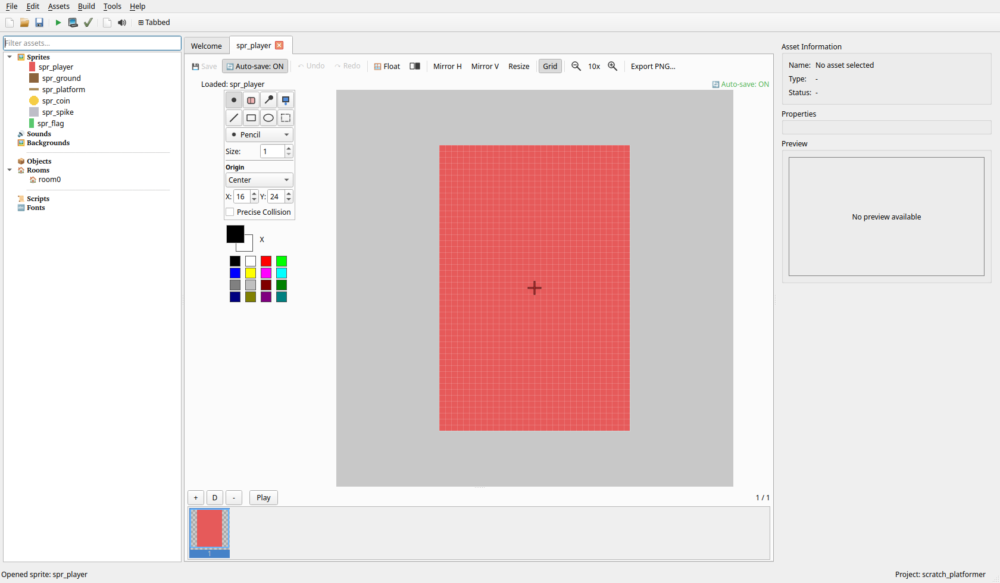
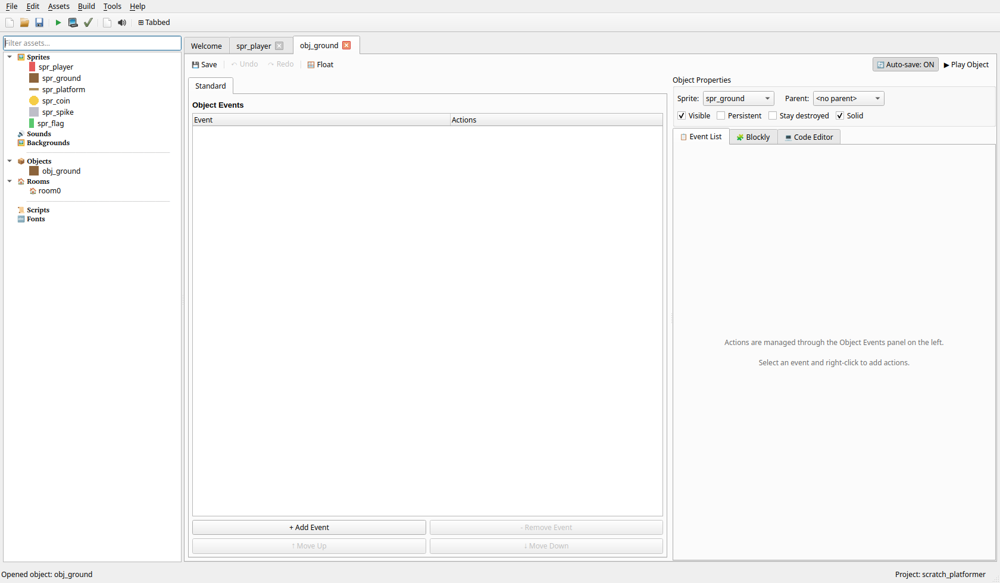
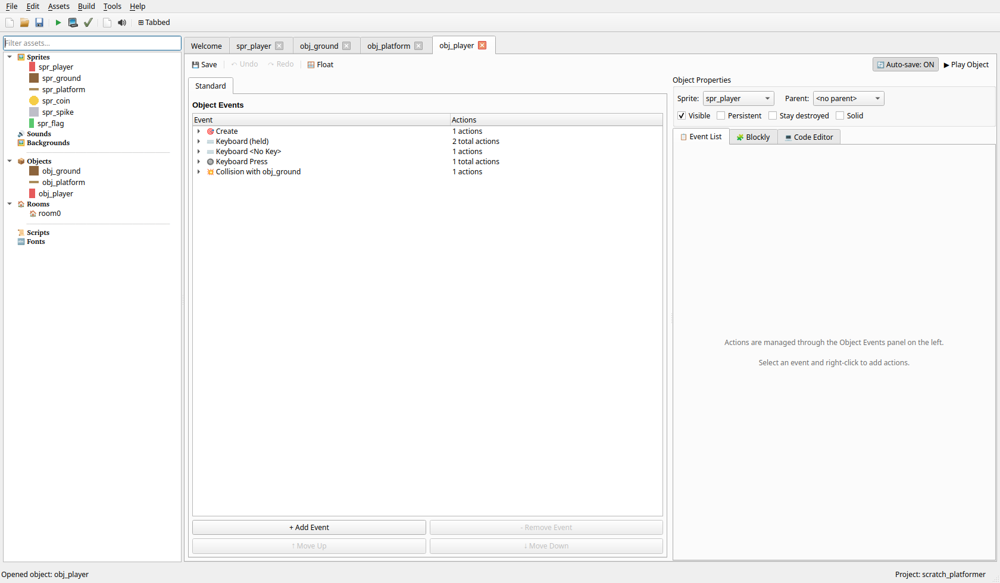
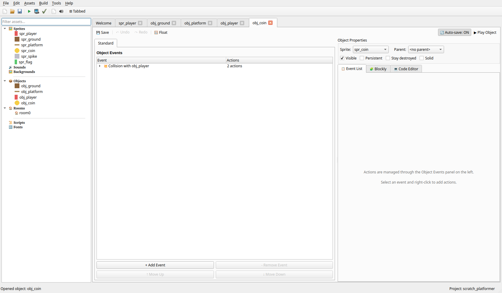
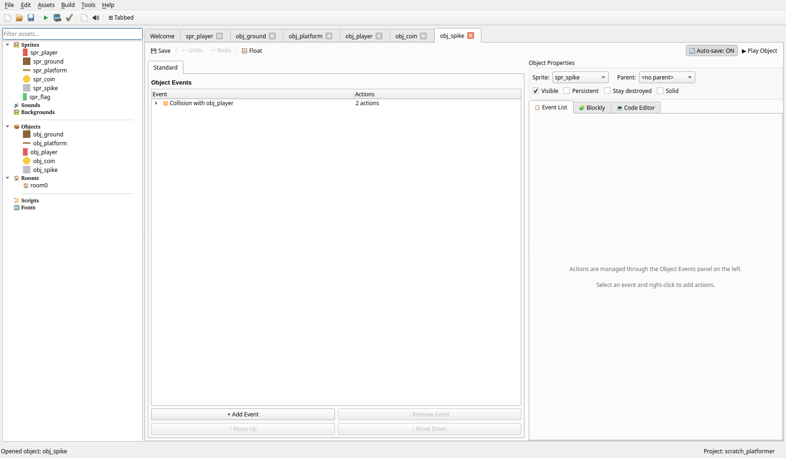
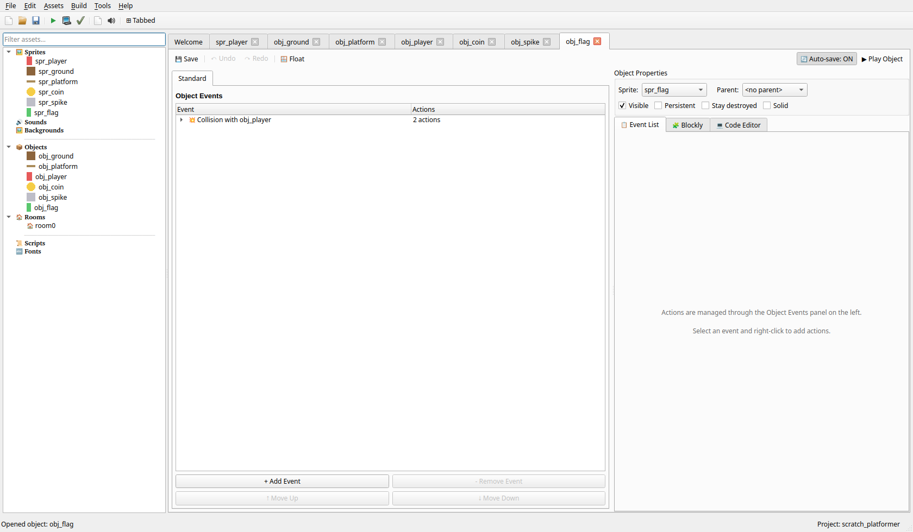
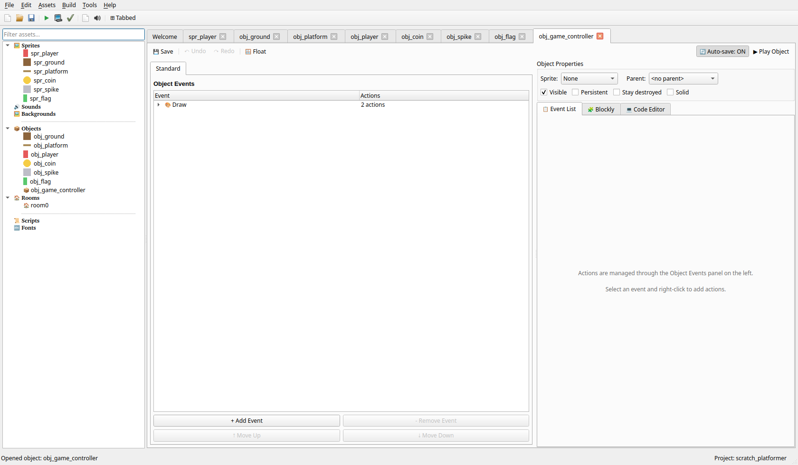
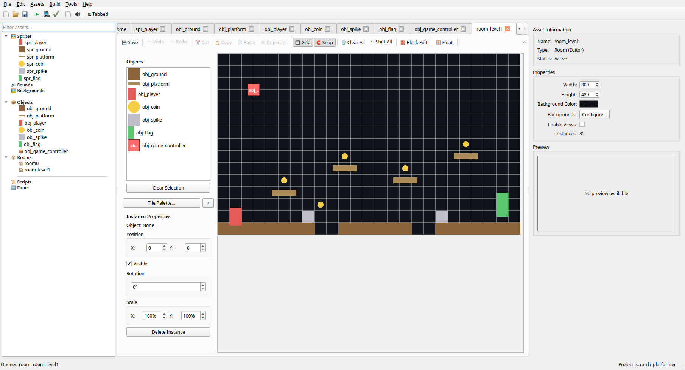

# Vodič: Ustvari Platformsko Igro

> **Select your language / Choisissez votre langue / Wählen Sie Ihre Sprache:**
>
> [English](Tutorial-Platformer) | [Français](Tutorial-Platformer_fr) | [Deutsch](Tutorial-Platformer_de) | [Italiano](Tutorial-Platformer_it) | [Español](Tutorial-Platformer_es) | [Português](Tutorial-Platformer_pt) | [Slovenščina](Tutorial-Platformer_sl) | [Українська](Tutorial-Platformer_uk) | [Русский](Tutorial-Platformer_ru)

---

## Uvod

V tem vodiču boš ustvaril **Platformsko Igro** - akcijsko igro s stranskim pomikanjem, kjer igralec teče, skače in navigira po platformah, medtem ko se izogiba nevarnostim in zbira kovance. Ta klasični žanr je odličen za učenje gravitacije, mehanike skakanja in trkov s platformami.

**Kaj se boš naučil:**
- Gravitacijo in fiziko padanja
- Mehaniko skakanja z zaznavanjem tal
- Trk s platformami (pristajanje na vrhu)
- Gibanje levo/desno
- Zbirateljske predmete in nevarnosti

**Težavnost:** Začetnik
**Prednastavitev:** Vmesna prednastavitev (dejanja Execute Code v razdelku Izboljšave niso v prednastavitvi za začetnike; osnovni vodič do 10. koraka potrebuje samo dejanja iz prednastavitve za začetnike)

---

## Korak 1: Razumevanje Igre

### Mehanike Igre
1. Na igralca vpliva gravitacija in pade
2. Igralec se lahko premika levo in desno
3. Igralec lahko skoči, ko stoji na tleh
4. Platforme preprečujejo igralcu, da bi padel skozi
5. Zbiraj kovance za točke
6. Doseži zastavo, da dokončaš raven

### Kaj Potrebujemo

| Element | Namen |
|---------|-------|
| **Igralec** | Lik, ki ga nadziraš |
| **Tla/Platforma** | Trdne površine za stanje |
| **Kovanec** | Zbirateljski predmeti za točke |
| **Bodica** | Nevarnost, ki poškoduje igralca |
| **Zastava** | Cilj, ki konča raven |

---

## Korak 2: Ustvari Sprite-e

### 2.1 Sprite Igralca

1. V **Drevesu Virov** z desnim klikom klikni na **Sprites** in izberi **Create Sprite**
2. Poimenuj ga `spr_player`
3. Klikni **Edit Sprite**, da odpreš urejevalnik sprite-ov
4. Nariši preprost lik (pravokotnik z obrazom ali paličnjaka)
5. Uporabi živo barvo, kot je modra ali rdeča
6. Velikost: 32x48 slikovnih pik (višji kot širši za lik)
7. Klikni **OK** za shranjevanje

### 2.2 Sprite Tal

1. Ustvari nov sprite z imenom `spr_ground`
2. Nariši ploščico platforme iz trave/zemlje
3. Uporabi rjave in zelene barve
4. Velikost: 32x32 slikovnih pik

### 2.3 Sprite Platforme

1. Ustvari nov sprite z imenom `spr_platform`
2. Nariši lebdečo platformo (les ali kamen)
3. Velikost: 64x16 slikovnih pik (široka in tanka)

### 2.4 Sprite Kovanca

1. Ustvari nov sprite z imenom `spr_coin`
2. Nariši majhen rumen/zlat krog
3. Velikost: 16x16 slikovnih pik

### 2.5 Sprite Bodice

1. Ustvari nov sprite z imenom `spr_spike`
2. Nariši trikotne bodice, obrnjene navzgor
3. Uporabi sive ali rdeče barve
4. Velikost: 32x32 slikovnih pik

### 2.6 Sprite Zastave

1. Ustvari nov sprite z imenom `spr_flag`
2. Nariši zastavo na drogu
3. Uporabi žive barve (zelena zastava, rjav drog)
4. Velikost: 32x64 slikovnih pik



---

## Korak 3: Ustvari Objekt Tla

Tla so trdna platforma, ki preprečuje igralcu, da bi padel.

1. Z desnim klikom klikni na **Objects** in izberi **Create Object**
2. Poimenuj ga `obj_ground`
3. Nastavi sprite na `spr_ground`
4. **Označi polje "Solid"**
5. Dogodki niso potrebni



---

## Korak 4: Ustvari Objekt Platforma

Platforme delujejo enako kot tla, vendar jih lahko postaviš v zrak.

1. Ustvari nov objekt z imenom `obj_platform`
2. Nastavi sprite na `spr_platform`
3. **Označi polje "Solid"**
4. Dogodki niso potrebni

**Namig:** platformo lahko narediš otroka od `obj_ground`, da si deli isto obnašanje pri trkih.


---

## Korak 5: Ustvari Objekt Igralec

Igralec je najbolj zapleten objekt z gravitacijo, skakanjem in gibanjem.

1. Ustvari nov objekt z imenom `obj_player`
2. Nastavi sprite na `spr_player`

### 5.1 Gravitacija

**Dogodek: Create** — Dodaj dejanje **Move** → **Set Gravity**
(Direction: `270`, Gravity: `0.5`) — 270° je naravnost navzdol; vrednost
se ob vsakem koraku prišteje k navpični hitrosti igralca, tako da igralec
od tu naprej sam pospešuje navzdol.

### 5.2 Gibanje, Skok in Trk s Tlemi

Dodaj te dogodke po istem vzorcu, kot ga že uporabljajo prejšnji vodiči
tega wikija:

| Dogodek | Dejanje |
|---|---|
| Keyboard (held) → Left Arrow | Set Horizontal Speed na `-4` |
| Keyboard (held) → Right Arrow | Set Horizontal Speed na `4` |
| Keyboard: No Key | Set Horizontal Speed na `0` |
| Key Press → Up Arrow | Set Vertical Speed na `-10` |
| Collision with obj_ground | Stop Movement |

Dve podrobnosti, zaradi katerih je občutek pravi:

- **No Key ponastavi na nič SAMO vodoravno hitrost** — tukaj nikoli ne
  uporabi Stop Movement, ker Stop Movement ponastavi na nič tudi navpično
  hitrost, kar bi preklicalo gravitacijo vsakič, ko igralec spusti
  smerno tipko.
- **Key Press (ne held)** je tisto, kar naredi Up en sam sunek skoka,
  namesto da bi igralca poganjalo navzgor ob vsakem sličici, ko je tipka
  pritisnjena. **Stop Movement** ob pristanku nato prekliče ta sunek,
  tako da igralec po pristanku ne nadaljuje z vzpenjanjem — vgrajeni trk
  s trdnimi objekti v pogonu (korak 3 je `obj_ground` že označil kot
  Solid) že preprečuje, da bi se igralec pogreznil v tla; dogodek tukaj
  samo počisti preostalo hitrost padanja.



---

## Korak 6: Ustvari Objekt Kovanec

Kovanci prištevajo k točkam, ko jih pobereš.

1. Ustvari nov objekt z imenom `obj_coin`
2. Nastavi sprite na `spr_coin`

**Dogodek: Collision with obj_player**
1. Dodaj Dogodek → Collision → obj_player
2. Dodaj dejanje **Score** → **Set Score**
   - New Score: `10`
   - Označi "Relative"
3. Dodaj dejanje **Main1** → **Destroy Instance**
   - Applies to: Self



---

## Korak 7: Ustvari Objekt Bodica

Bodice poškodujejo igralca in ponovno zaženejo raven.

1. Ustvari nov objekt z imenom `obj_spike`
2. Nastavi sprite na `spr_spike`

**Dogodek: Collision with obj_player**
1. Dodaj Dogodek → Collision → obj_player
2. Dodaj dejanje **Main2** → **Show Message**
   - Message: `Ouch! You hit a spike!`
3. Dodaj dejanje **Main1** → **Restart Room**



---

## Korak 8: Ustvari Objekt Zastava

Zastava konča raven, ko jo igralec doseže.

1. Ustvari nov objekt z imenom `obj_flag`
2. Nastavi sprite na `spr_flag`

**Dogodek: Collision with obj_player**
1. Dodaj Dogodek → Collision → obj_player
2. Dodaj dejanje **Output** → **Show Message**
   - Message: `Level Complete!`
3. Dodaj dejanje **Room** → **Next Room** (ali **Restart Room** za eno raven)

Besedilo Show Message je nespremenljiv niz — ne more vgraditi žive
vrednosti, kot je rezultat. HUD igralnega kontrolerja (korak 9) že
prikazuje rezultat na zaslonu skozi celotno raven, tako da ga je igralec
že videl.



---

## Korak 9: Ustvari Igralni Kontroler

Igralni kontroler prikazuje rezultat.

1. Ustvari nov objekt z imenom `obj_game_controller`
2. Sprite ni potreben

**Dogodek: Draw**
1. Dodaj Dogodek → Draw → Draw
2. Dodaj dejanje **Draw** → **Draw Text** (Text: `Score:`, X: `10`, Y: `10`)
3. Dodaj dejanje **Draw** → **Draw Variable** (Variable: `score`, X: `70`, Y: `10`)

Neobvezno: dodaj par **Draw Text** (`Lives:`, X `10`, Y `30`) + **Draw
Variable** (`lives`, X `70`, Y `30`) na enak način, ko je spodnja
izboljšava Sistem Življenj na mestu.



---

## Korak 10: Oblikuj Svojo Raven

1. Z desnim klikom klikni na **Rooms** in izberi **Create Room**
2. Poimenuj jo `room_level1`
3. Nastavi velikost room (npr. 800x480)
4. Vklopi "Snap to Grid" in nastavi mrežo na 32x32

### Postavljanje Objektov

Zgradi svojo raven po teh smernicah:

1. **Ustvari tla** - Postavi `obj_ground` vzdolž dna
2. **Dodaj platforme** - Postavi `obj_platform` v zrak za skakalne izzive
3. **Dodaj vrzeli** - Pusti prostore v tleh (jame)
4. **Postavi kovance** - Razmeči jih po platformah in na težko dostopna mesta
5. **Dodaj bodice** - Blizu jam ali na platforme za izziv
6. **Postavi zastavo** - Na konec ravni
7. **Postavi igralca** - Na začetek (leva stran)
8. **Dodaj igralni kontroler** - Kamor koli (je neviden)

### Primer Postavitve Ravni

```
                                        F
                                      ===
                          C       C
                        =====   =====
            C                           C
          ===== X     X         X     =====
    P                   C
  ====== === ===   ===   === === ===== ======
  GGGGGG     GGG   GGG   GGG         GGGGGGGG

G = Tla    P = Igralec    F = Zastava    C = Kovanec
X = Bodica    === = Platforma
```



---

## Korak 11: Preizkusi Svojo Igro!

1. Klikni **Zaženi** ali pritisni **F5** za preizkus
2. Za premikanje uporabi puščici **Levo/Desno**
3. Pritisni **Gor** ali **Preslednico** za skok
4. Zbiraj kovance za točke
5. Izogibaj se bodicam!
6. Doseži zastavo za zmago!

---

## Izboljšave (Neobvezno)

### Dodaj Spremenljivo Višino Skoka

Dodaj dogodek **Step** na `obj_player` z **Control** → **Execute Code**
(pravi Python — `self` je trenutni primerek, `keyboard` omogoča preverjanje
pritisnjene tipke po imenu):

```python
# Prekine skok, če je Up spuščen med vzpenjanjem
if self.vspeed < 0 and not keyboard.check('up'):
    self.vspeed = max(self.vspeed, -5)  # polovica sunka skoka -10
```

### Dodaj Dvojni Skok

To lahko narediš v celoti s strukturiranimi dejanji — koda ni potrebna.

**Dogodek: Create** — Dodaj dejanje **Control** → **Set Variable**
(Variable: `jumps_left`, Value: `2`)

**Dogodek: Collision with obj_ground** — za **Stop Movement** dodaj
**Control** → **Set Variable** (Variable: `jumps_left`, Value: `2`), da ob
pristanku napolniš oba skoka.

Zamenjaj edino dejanje obstoječega dogodka **Key Press → Up Arrow** s
tremi, po vrsti:
1. **Control** → **Test Variable** (Variable: `jumps_left`, Value: `0`,
   Operation: `greater`)
2. **Control** → **Start Block**
3. **Move** → **Set Vertical Speed** (`-10`)
4. **Control** → **Set Variable** (Variable: `jumps_left`, Value: `-1`,
   **Relative** označeno)
5. **Control** → **End Block**

Par Start/End Block pomeni, da se obe dejanji znotraj izvedeta le, ko je
Test Variable nad njima resničen — isti vzorec zaščitenega bloka, ki ga
vodiča Sokoban in Labirint uporabljata za svoje pogoje.

### Dodaj Premikajoče se Platforme

1. Ustvari `obj_moving_platform` kot otroka od `obj_platform`

**Dogodek: Create** — Dodaj dejanje **Control** → **Execute Code**:

```python
self.start_x = self.x
self.hspeed = 2
```

**Dogodek: Step** — Dodaj dejanje **Control** → **Execute Code**:

```python
if self.x > self.start_x + 100:
    self.hspeed = -2
elif self.x < self.start_x:
    self.hspeed = 2
```

### Dodaj Sovražnika

1. Ustvari `obj_enemy` s preprosto UI

**Dogodek: Create** — Dodaj dejanje **Move** → **Start Moving Direction**
(Directions: `right`, Speed: `2`)

**Dogodek: Collision with obj_ground** — Dodaj dejanje **Move** →
**Reverse Horizontal** (obrne se ob zidovih; skupaj s tem, da je
`obj_ground` Solid, sovražnik nikoli ne more zakorakati z roba platforme v
tla spodaj ali skozi zid)

**Dogodek: Collision with obj_player** — ta dogodek se sproži na
`obj_enemy`, torej je `self` sovražnik in `other` igralec. Dodaj dejanje
**Control** → **Test Expression** z ugnezdenimi dejanji Then/Else (isti
vzorec, ki ga priloženi vzorec `plateforme_3` uporablja prav za to
preverjanje "skoka na glavo", le zrcaljeno, ker preverjanje tukaj živi na
sovražniku namesto na igralcu):
   - Expression: `other.vspeed > 0 and other.y - other.vspeed < y - 16`
   - Then Actions: **Control** → **Execute Code** z `other.vspeed = -5`
     (majhen odboj za igralca — `set_vspeed` nima možnosti "applies to
     other", zato je to edino mesto, ki potrebuje vrstico pravega Pythona
     namesto strukturiranega dejanja), nato **Instance** → **Destroy
     Instance** (self)
   - Else Actions: **Room** → **Restart Room** (igralec umre)

`other.vspeed > 0 and other.y - other.vspeed < y - 16` preveri položaj
*igralca* od pred gibanjem padanja v tej sličici (z uporabo igralčevega
lastnega `vspeed`, saj pada on), tako da hitro padanje ne more preskočiti
16-pikselskega okna skoka v enem koraku — glej README od `plateforme_3` za
celotno zgodbo, zakaj je naivna različica `other.y < y - 16` krhka.

### Dodaj Sistem Življenj

V dogodku **Create** objekta `obj_game_controller` dodaj **Score** → **Set
Lives** (Value: `3`).

Ko igralec umre (trk z bodico in veja Else sovražnika zgoraj), zamenjaj
**Restart Room** s **Score** → **Set Lives** (Value: `-1`, **Relative**
označeno) — room se ponovno zažene samodejno, ker se dogodek **No More
Lives** sproži šele, ko življenja dejansko dosežejo 0. Dodaj ta dogodek na
`obj_game_controller`: **Other Events** → **No More Lives** → **Output** →
**Show Message** (`Game Over!`) → **Room** → **Restart Game**.

---

## Odpravljanje Težav

| Težava | Rešitev |
|--------|---------|
| Igralec pade skozi tla | Preveri, da ima `obj_ground` označeno "Solid" |
| Igralec ne more skočiti | Preveri, da dogodek Key Press → Up Arrow obstaja in da je Set Vertical Speed negativen |
| Igralec se po pristanku še naprej vzpenja | Poskrbi, da ima Collision with obj_ground dejanje Stop Movement |
| Skok se zdi "lebdeč" | Povečaj vrednost Gravity v Set Gravity ali naredi vrednost skoka v Set Vertical Speed bolj negativno |
| Skok se zdi prešibek | Zmanjšaj vrednost Gravity v Set Gravity ali naredi vrednost skoka v Set Vertical Speed bolj negativno |

---

## Kaj Si Se Naučil

Čestitke! Ustvaril si platformsko igro! Naučil si se:

- **Fiziko gravitacije** - Set Gravity ob vsakem koraku uporabi stalno silo navzdol
- **Mehaniko skakanja** - Dogodek Key Press (ne held) da en sam sunek hitrosti navzgor
- **Vgrajeni trk s trdnimi objekti** - Tla samodejno blokirajo igralca, ko so označena kot Solid, brez ročne kode za preverjanje položaja
- **Nevarnosti** - Ustvarjanje objektov, ki ponovno zaženejo raven
- **Oblikovanje ravni** - Gradnja platformskih izzivov

---

## Ideje za Izzive

1. **Skok od Zidu** - Omogoči odskok od zidov
2. **Poteza Sunka (Dash)** - Kratek vodoraven pospešek hitrosti
3. **Krušljive Platforme** - Platforme, ki padejo, ko stopiš nanje
4. **Kontrolne Točke** - Shranjevanje napredka sredi ravni
5. **Boj z Bossom** - Dodaj končnega sovražnika z več zadetki

---

## Glej Tudi

- [Vodiči](Tutorials_sl) - Več vodičev za igre
- [Vmesna prednastavitev](Intermediate-Preset_sl) - Pregled prednastavitve, ki jo potrebuje razdelek Izboljšave
- [Vodič: Labirint](Tutorial-Maze_sl) - Ustvari igro navigacije po labirintu
- [Vodič: Breakout](Tutorial-Breakout_sl) - Ustvari igro razbijanja zidov
- [Referenca Dogodkov](Event-Reference_sl) - Popolna dokumentacija dogodkov
